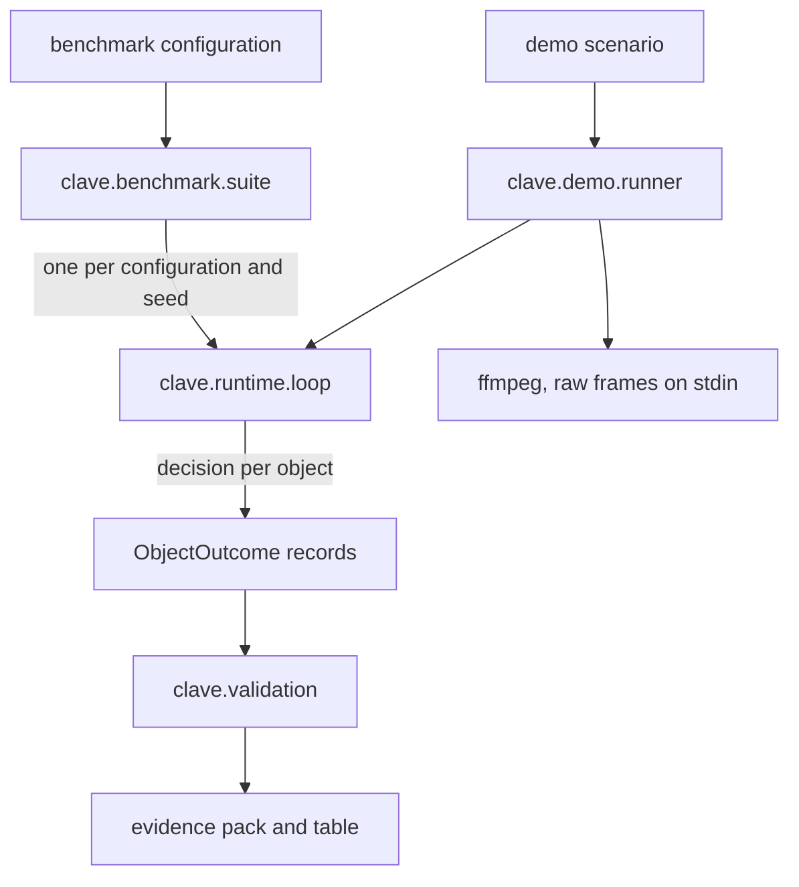

# Design Document

## Overview

One command runs every configuration CLAVE can run, scores them by one protocol,
and writes a table plus an evidence pack. A second command runs a named scenario
and records a video of it.

Neither introduces a metric. v0.8.0's validation harness owns metrics and gates,
v0.9.0's runtime owns the loop, and this step wires them together and reports
what comes out.

### What can be measured, and what cannot

The release criteria ask for throughput, per-class sorting accuracy, pick
success rate, cycle time and latency percentiles. Three of those are available
and two are not, because nothing in CLAVE executes a pick.

| Metric | Status | Why |
|---|---|---|
| Throughput | Measured | Objects presented and decisions published per simulated second |
| Per-class sorting accuracy | Measured | The world knows each object's class and the loop publishes a predicted one |
| Decision latency percentiles | Measured | Already measured at v0.9.0, per configuration here |
| Pick success rate | Unmeasured | Nothing grasps. Every record carries `picked = False` by construction |
| Cycle time | Unmeasured | There is no placement to measure to |

The benchmark reports the two unmeasured ones as unmeasured, with that reason
attached, satisfying 1.3. Reporting a pick success rate of zero would be
arithmetically true and would read as a result rather than as an absence.

### Goals

- One fair comparison: same seeds, same world, same protocol.
- Every number reproducible from a seed and a digest.
- A demonstration a person can watch.

### Non-Goals

- Training anything new.
- Executing a pick, which needs FRET.
- Any claim of readiness.

## Boundary Commitments

### This Spec Owns

- `src/clave/benchmark/`: the suite, its configuration and its evidence pack.
- `src/clave/demo/`: the scenario runner and the video recorder.
- `configs/benchmark/default.yml`, `configs/demos/*.yml`.

### Out of Boundary

- **Metrics and gates.** v0.8.0 owns them.
- **The loop.** v0.9.0 owns it; the benchmark calls it.
- **Training.** Checkpoints are consumed as they are.

### Allowed Dependencies

| Dependency | Direction | Criticality | Note |
|---|---|---|---|
| `clave.runtime` | Inbound | P0 | The loop each configuration runs |
| `clave.validation` | Inbound | P0 | Metrics, gates and the report |
| `clave.world` | Inbound | P0 | The world and its ground truth |
| `ffmpeg` | External | P2 | Encodes the demo video. Absent means no video, not a failure |

### Revalidation Triggers

- Something executes a pick, at which point two unmeasured metrics become
  measurable and the gates that depend on them start to bind.
- A new candidate trains, which adds a row.

## Architecture



### How an outcome is produced

One record per object that entered the reachable window, which is the population
the validation harness defines. Its true class comes from the world, which
tagged the object at spawn. Its predicted class comes from the last decision
published for that object, or is absent when no decision was published for it.

The pool never recycles a slot inside a rollout, so an object identity is unique
within a run and a record cannot merge two objects.

Every record carries `picked = False` and no routed channel, because nothing
grasped it. That is what makes pick success and cycle time unmeasurable rather
than zero, and the report says so in those words.

`seen_instance` is true for every record. The benchmark runs the world the
models trained on, so generalization to unseen instances is not measured here
and the report states it rather than letting a gate pass on a population of one.

## File Structure Plan

```
configs/benchmark/default.yml
configs/demos/sorting_line.yml
configs/demos/fast_belt.yml
src/clave/benchmark/__init__.py
src/clave/benchmark/config.py
src/clave/benchmark/suite.py
src/clave/benchmark/pack.py
src/clave/demo/__init__.py
src/clave/demo/scenario.py
src/clave/demo/video.py
src/clave/demo/runner.py
tests/benchmark/config_test.py
tests/benchmark/suite_test.py
tests/demo/scenario_test.py
tests/demo/video_test.py
docs/research/benchmark.md
```

| File | Status | Responsibility |
|---|---|---|
| `config.py` | New | The configurations to compare, from YAML |
| `suite.py` | New | Run each, collect outcomes, score them |
| `pack.py` | New | The evidence pack and the comparison table |
| `scenario.py` | New | One demonstration's settings, from YAML |
| `video.py` | New | Raw frames to ffmpeg, or a stated absence |
| `runner.py` | New | Run a scenario and report it |
| `loop.py` | Modified | Optional per-object outcomes and video frames |
| `cli.py` | Modified | `clave benchmark` and `clave demo` |

## The video

MuJoCo renders offscreen through OSMesa at roughly 52 ms a frame. The loop
captures a frame every half simulated second, which is far too sparse to watch,
so the video renders on its own cadence from the same stepped world.

Frames go to `ffmpeg` on standard input as raw `rgb24`, which needs no Python
imaging library and no new dependency in the wheel. A machine without `ffmpeg`
runs the scenario and says no video was recorded, satisfying 3.5.

**Nothing is drawn on a frame.** The video is what the simulator rendered,
encoded. No overlay, no annotation, no composition, satisfying 3.4 and the
project's rule against presenting post-processed output as real.

## Error Handling

| Condition | Response |
|---|---|
| A checkpoint or library a configuration needs is absent | That row is `Unavailable` with the reason; the suite continues, per 2.3 |
| `ffmpeg` absent | The scenario runs; the report says no video, per 3.5 |
| A gate fails | Reported as a failure in the table; the command's exit status says so |
| No object entered the window in a run | The configuration reports zero presented rather than dividing by it |

## Testing Strategy

| Test | Proves |
|---|---|
| The shipped benchmark configuration loads and names its configurations | 1.1 |
| A missing key fails naming itself | 2.1 |
| Outcomes are built one per object that entered the window | 1.2 |
| An object with no decision carries no predicted class | 1.2 |
| Every record carries `picked = False`, so pick metrics are unmeasured | 1.3 |
| An unavailable configuration is recorded with its reason and does not stop the suite | 2.3 |
| The evidence pack round-trips through JSON | 2.2 |
| The recommendation names a configuration present in the results | 1.4 |
| A scenario loads every tunable from its file | 3.2 |
| The recorder writes a playable file, and says so when ffmpeg is absent | 3.3, 3.5 |

The suite's own test uses recorded outcomes rather than a live loop, because a
live loop needs MuJoCo and a GL backend. The loop is already covered at v0.9.0.

## Requirements Traceability

| Requirement | Component | Contract |
|---|---|---|
| 1.1 | suite | Same seeds, same world |
| 1.2 | suite, pack | Throughput, accuracy, latency, gates |
| 1.3 | pack | Unmeasured named, not omitted |
| 1.4 | pack | A recommendation with a measured reason |
| 1.5 | cli | `clave benchmark` |
| 2.1 | pack | Seeds, digests, machine |
| 2.2 | pack | JSON evidence pack |
| 2.3 | suite | Unavailable recorded, suite continues |
| 2.4 | suite | Same seeds give the same accuracy |
| 3.1 | cli, runner | `clave demo <scenario>` |
| 3.2 | scenario | Every tunable from the file |
| 3.3 | video | A recorded video |
| 3.4 | video | No overlay |
| 3.5 | video | Absent encoder states itself |
| 3.6 | runner | Prints decisions and overrides |

## Open Questions and Risks

- **The comparison is small.** Three configurations, one world, one dataset of
  240 synthetic frames. It compares what exists rather than what matters.
- **Two of five headline metrics are unmeasurable**, which makes the gate set
  partly inert. The report names every inert gate.
- **The benchmark world is the training world**, so every number is in-sample.
  This is the largest caveat in the release and it belongs in the release notes
  rather than a footnote.
