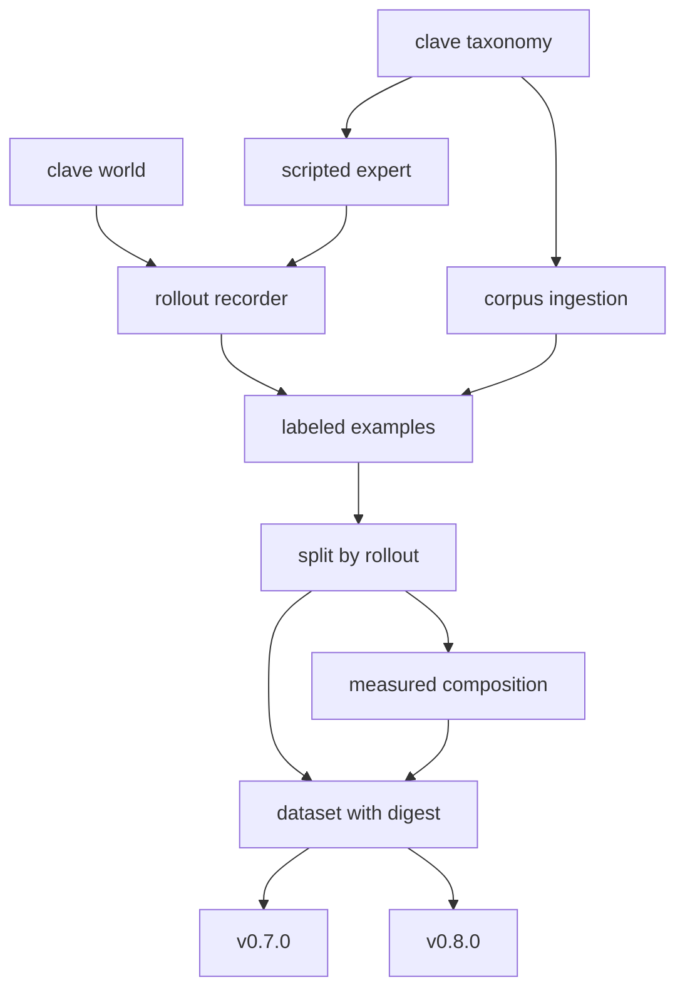

# Design Document

## Overview

This design turns the simulated world into datasets v0.7.0 can train on and
v0.8.0 can score.

Its centre of gravity is not the recording, which is mechanical, but the three
properties that make a dataset trustworthy: splits that provably do not leak,
composition reported as measured rather than as requested, and a digest so that
two runs can be shown to have seen the same bytes.

Labels come from the simulator. The world already knows every object's material
class, so a synthetic example is labeled by construction and the usual source of
label noise does not arise. What it does not give is appearance: these are
primitives, and the delivered document says so.

### Goals

- Record rollouts as labeled examples, reproducibly from a seed.
- A scripted expert producing pick decisions, so imitation learning has a
  teacher.
- Splits partitioned by rollout, verified free of leakage, failing rather than
  reporting a leak.
- Composition measured per split part.
- Datasets that resolve by digest and are never committed.
- An ingestion path applying the taxonomy's corpus mappings, honest that no
  corpus has been fetched.

### Non-Goals

- Training, metrics, gates, accuracy.
- Fetching a corpus. That is an operator action, not a gate step.
- Changing the world or the taxonomy.

## Boundary Commitments

### This Spec Owns

- `clave.data`: examples, recorder, expert, splits, composition, dataset
  read and write, corpus ingestion.
- `configs/data/recording.yml`.
- The `record-dataset` command.

### Out of Boundary

- **Training loops, optimizers, models.** v0.7.0.
- **Metrics and gates.** v0.8.0 owns those; this feature produces what they
  score and does not score anything.
- **The world's physics and the object set.** v0.5.0.
- **Fetching corpora.** The manifest from v0.3.0 already describes them; this
  feature reads what is present and says so when nothing is.

### Allowed Dependencies

| Dependency | Direction | Criticality | Note |
|---|---|---|---|
| `clave.world` | Inbound | P0 | Supplies the scene, the belt and labeled objects |
| `clave.taxonomy` | Inbound | P0 | Classes and channels |
| `clave.experiment.seeding` | Inbound | P0 | The single seeding entry point |
| `clave.corpus` | Inbound | P1 | Digest machinery, reused rather than reimplemented |
| `mujoco` | External | P0 | Stepping and offscreen rendering |

### Revalidation Triggers

- The world changes its object set or belt geometry, invalidating every recorded
  dataset.
- The taxonomy changes a class, invalidating every label.
- A corpus is fetched, at which point the ingestion path gets its first real
  exercise and its fixture-only status ends.

## Architecture

### Architecture Pattern and Boundary Map



Splitting happens before composition on purpose: composition is reported per
part, and a class present overall can still be absent from the test part, which
is the case that silently breaks a confusion matrix.

### Technology Stack

| Layer | Tool | Role |
|---|---|---|
| Physics and rendering | `mujoco` with the OSMesa backend | Offscreen rendering on CPU, measured at about 52 ms per frame at 320 by 240 |
| Arrays and storage | `numpy` compressed archives | One archive per rollout, no new dependency |
| Index and description | JSON | Readable without importing project code, as the run record already is |
| Digests | `clave.corpus.artifacts` | Reused, not reimplemented |

Rendering runs on CPU through OSMesa because this machine has no usable
accelerator. At roughly 52 ms per frame a ten thousand frame dataset costs about
nine minutes, which is affordable; a hundred thousand would not be.

## File Structure Plan

```
configs/data/recording.yml
src/clave/data/__init__.py
src/clave/data/examples.py
src/clave/data/expert.py
src/clave/data/recorder.py
src/clave/data/splits.py
src/clave/data/composition.py
src/clave/data/dataset.py
src/clave/data/ingest.py
tests/data/examples_test.py
tests/data/expert_test.py
tests/data/splits_test.py
tests/data/composition_test.py
tests/data/dataset_test.py
tests/data/ingest_test.py
tests/data/recorder_test.py
```

| File | Status | Responsibility |
|---|---|---|
| `examples.py` | New | `ObjectLabel`, `Example`, `Rollout` |
| `expert.py` | New | Scripted pick policy over reachable objects |
| `recorder.py` | New | Step the world, capture frames, emit examples |
| `splits.py` | New | Partition by rollout, verify no leakage |
| `composition.py` | New | Measured counts per part, absent classes named |
| `dataset.py` | New | Write and read with a digest and a description |
| `ingest.py` | New | Corpus label mapping with ambiguity and unmapped recorded |
| `src/clave/cli.py` | Modified | Gains `record-dataset` |
| `.gitignore` | Modified | Datasets are never committed |

## Components and Interfaces

| Component | Intent | Requirements |
|---|---|---|
| Examples | Labeled by construction | 1.1, 1.2, 1.5 |
| Recorder | Reproducible capture | 1.3, 1.4 |
| Expert | A teacher for imitation | 2.1, 2.2, 2.3, 2.4, 2.5 |
| Splits | No leakage, provably | 3.1, 3.2, 3.3, 3.4, 3.5 |
| Composition | Measured, per part | 4.1, 4.2, 4.3, 4.4 |
| Dataset | Resolves by digest | 5.1, 5.2, 5.3, 5.4 |
| Ingestion | Taxonomy mapping applied | 6.1, 6.2, 6.3, 6.4, 6.5 |

### Examples

An `ObjectLabel` carries identity, material class, channel, belt position, and
whether the object was inside the reachable window at capture. That last field
satisfies 1.5 and matters because an object outside the window cannot be picked,
so training on it as a pick target teaches a false association.

An `Example` carries the frame, its object labels, the simulated time, the seed
and the world configuration digest, satisfying 1.1, 1.2 and 1.3.

### Expert

The expert selects among objects currently inside the reachable window, prefers
the one nearest the window's exit because it has least time remaining, and
resolves its channel through the taxonomy. With no reachable object it emits
nothing rather than a decision naming nothing, satisfying 2.5.

It is deliberately simple. Its job is to be a teacher whose behavior is
explainable, not to be good.

### Splits

Partitioning is by rollout, not by frame, satisfying 3.2. Two frames of one
object are correlated almost perfectly, so a frame-level split would put near
duplicates on both sides of the boundary and inflate every number after it.

After partitioning, membership is checked for overlap and a leak fails rather
than being reported, satisfying 3.4. Proportions that do not sum to one fail
naming them, satisfying 3.5.

### Composition

Counts are computed from the examples actually present, never from the
proportions requested, satisfying 4.4. Classes with no instances are named,
satisfying 4.2, and everything is reported per part, satisfying 4.3.

### Dataset

A dataset is a directory of per-rollout archives plus a JSON description
carrying the digest, the seed, the configuration digest and the composition,
satisfying 5.1 and 5.2. Reading verifies the digest and refuses a mismatch,
satisfying 5.3. Nothing is committed, satisfying 5.4.

### Ingestion

A corpus label maps to one or more taxonomy classes. Several classes are
recorded as an ambiguity rather than collapsed to one, satisfying 6.2, which
matters because ZeroWaste's `rigid_plastic` spans four classes. An unmapped
label is recorded rather than discarded, satisfying 6.3. Examples carry their
origin so real and synthetic stay separable, satisfying 6.4.

## Data Models

- **ObjectLabel**: object id, material class, channel, belt position,
  in-reachable-window flag.
- **Example**: frame array, object labels, simulated time, seed, world
  configuration digest, origin.
- **Rollout**: identity, seed, ordered examples.
- **SplitPlan**: part name to rollout identities.
- **Composition**: part name to class counts, plus absent classes.
- **DatasetDescription**: digest, seed, configuration digest, composition,
  example count, origin counts.

**Invariants:**

1. Every `ObjectLabel` material class is in the taxonomy.
2. No rollout identity appears in more than one split part.
3. Composition counts sum to the example count.
4. A dataset description's digest matches its contents.

## Error Handling

| Condition | Response |
|---|---|
| Split proportions do not sum to one | Fail naming them, per 3.5 |
| A rollout appears in two parts | Fail rather than report, per 3.4 |
| Dataset digest mismatch on read | Refuse, per 5.3 |
| Corpus label maps to nothing | Record unmapped, per 6.3 |
| Corpus label spans several classes | Record the ambiguity, per 6.2 |
| No reachable object for the expert | Emit no decision, per 2.5 |

## Testing Strategy

| Test | Proves |
|---|---|
| One seed twice records identical examples | 1.4 |
| Labels carry class, identity, position, window flag | 1.2, 1.5 |
| The expert only decides on reachable objects | 2.2 |
| The expert resolves the channel from the taxonomy | 2.3 |
| No reachable object yields no decision | 2.5 |
| Splits partition by rollout | 3.2 |
| One seed twice gives identical partitions | 3.3 |
| An overlapping partition fails | 3.4 |
| Proportions not summing to one fail naming them | 3.5 |
| Composition counts are measured, not requested | 4.4 |
| Absent classes are named per part | 4.2, 4.3 |
| A written dataset reads back and verifies | 5.1, 5.3 |
| A tampered dataset is refused | 5.3 |
| A spanning corpus label records ambiguity | 6.2 |
| An unmapped corpus label is kept | 6.3 |
| Real and synthetic remain separable | 6.4 |

Tests needing MuJoCo skip when it is absent, as the world tests already do.

## Requirements Traceability

| Requirement | Component | Contract |
|---|---|---|
| 1.1 | Examples | One example per captured frame |
| 1.2 | Examples | Class, identity, position from the world |
| 1.3 | Recorder | Seed, configuration digest, simulated time |
| 1.4 | Recorder | Identical under one seed |
| 1.5 | Examples | In-reachable-window flag |
| 2.1 | Expert | Selects and decides |
| 2.2 | Expert | Reachable objects only |
| 2.3 | Expert | Channel from the taxonomy |
| 2.4 | Expert | Deterministic under one seed |
| 2.5 | Expert | No reachable object, no decision |
| 3.1 | Splits | Train, validation, test at proportions |
| 3.2 | Splits | Partition by rollout |
| 3.3 | Splits | Deterministic under one seed |
| 3.4 | Splits | Overlap fails |
| 3.5 | Splits | Bad proportions fail naming them |
| 4.1 | Composition | Example and per-class counts |
| 4.2 | Composition | Absent classes named |
| 4.3 | Composition | Per split part |
| 4.4 | Composition | Measured, not requested |
| 5.1 | Dataset | Digest over contents |
| 5.2 | Dataset | One description carrying all of it |
| 5.3 | Dataset | Mismatch refused |
| 5.4 | Dataset | Nothing committed |
| 6.1 | Ingestion | Taxonomy mapping applied |
| 6.2 | Ingestion | Ambiguity recorded |
| 6.3 | Ingestion | Unmapped kept |
| 6.4 | Ingestion | Origin separable |
| 6.5 | Ingestion | Fixture-only status stated |

## Open Questions and Risks

- **No corpus has been fetched**, so ingestion is exercised against a fixture.
  Its first real test comes when an operator downloads one and records its
  digest.
- **Synthetic frames show primitives.** A classifier trained only on them learns
  shape, not material. These datasets are strong for the pick policy and weak
  for perception, and that asymmetry should shape how v0.7.0 uses them.
- **The expert is simple by design.** If imitation from it produces a policy
  that matches it exactly, that says the imitation worked, not that the
  behavior is good.
