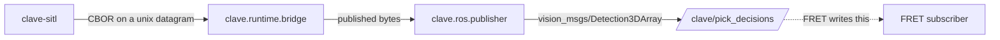

# Design Document

## Overview

CLAVE publishes its pick decision on a ROS 2 topic. That is the whole step.

The decision already exists, already carries every field a consumer needs, and
is already published on a Unix datagram in the contract's CBOR encoding. What is
missing is a hop onto the middleware FRET runs on.

### What was read before this was written

FRET is a ROS 2 Jazzy stack with OpenMANIPULATOR-X and OpenMANIPULATOR-Y
pick-and-place running in MuJoCo physics, ARCO planning behind a planner node,
and a joint-space controller. Two facts from its source shape this design.

Its `PickPlaceObservation` carries `object_pos` and a `ball_detected` flag that
starts a cycle, and `PickPlaceWaypoints.with_pick` exists so an estimate can
replace the pick pose. That is the slot CLAVE's decision fills.

Its manipulator pipeline builds that observation inside in-process simulation
runners rather than from a subscription, so **no FRET topic exists to publish
into today**. The subscriber is FRET's to write. This design is what it writes
against, and nothing here claims an arm moved.

### Goals

- One message per decision, on a documented topic, in a standard message type.
- A field mapping precise enough to implement a subscriber from the document.
- No planner, controller or simulator enters CLAVE.

### Non-Goals

- Moving anything.
- A conveyor scene in FRET, which is FRET v1.5 work in FRET's repository.
- Changing the decision contract.

## Boundary Commitments

### This Spec Owns

- `src/clave/ros/`: decoding a published decision and publishing it.
- `crates/clave-decision/contract/ros-decision.md`: the topic and the mapping.
- The seam in `clave.runtime.bridge` that hands published bytes to a consumer.

### Out of Boundary

- **FRET.** No file in FRET changes.
- **The decision contract and its CBOR encoding.** Consumed, not redesigned.
- **The safety layer, the routing policy and the publisher crate.** Unchanged.

### Allowed Dependencies

| Dependency | Direction | Criticality | Note |
|---|---|---|---|
| `rclpy`, `vision_msgs`, `geometry_msgs`, `std_msgs` | External | P0 | From a ROS 2 installation, never from this repository's wheel |
| `cbor2` | External | P0 | Decodes the published contract. Optional extra |
| `clave.taxonomy` | Inbound | P1 | Class and channel identifiers |

### Revalidation Triggers

- The decision contract version moves.
- FRET writes the subscriber and finds a field it cannot use.

## Architecture



The dotted arrow is the part this step does not build.

### Why the runtime feeds the publisher rather than a second process

The runtime already binds the socket the Rust side publishes onto and already
drains it. Giving it an optional sink costs one callback and keeps one consumer
of one socket. A second process would have to take the socket away from the
runtime, which would silently zero the counter that proves every accepted
decision arrived.

The publisher receives the published bytes rather than the proposal that
produced them, satisfying `AC-ROSPUB-02`. Building the message from the proposal
would be easier and would create a second path that can drift from the contract
without any test noticing.

## The message

`vision_msgs/Detection3DArray` on `/clave/pick_decisions`, one `Detection3D` per
decision, satisfying `AC-ROSMAP-05`. A standard type means FRET needs no
interface package from this repository, and `ros2 topic echo`, RViz and `rosbag`
all work on day one.

| Decision field | Message field | Unit and meaning |
|---|---|---|
| Object identity | `detections[i].id` | The identity the tracker assigned, as a decimal string |
| Material class | `results[0].hypothesis.class_id` | Taxonomy identifier, `M-01` to `M-11` |
| Confidence | `results[0].hypothesis.score` | Classifier confidence, 0.0 to 1.0 |
| Resolved channel | `results[1].hypothesis.class_id` | `channel:<n>`, where `n` is the channel number the operator's map resolved |
| Routing certainty | `results[1].hypothesis.score` | Always 1.0. Routing is deterministic given the class and the threshold |
| Pick point | `results[0].pose.pose.position` | Meters in the belt frame |
| Pick yaw | `results[0].pose.pose.orientation` | Rotation about the belt normal |
| Window start | `header.stamp` | The instant the object becomes reachable |
| Window end | `bbox.size.x` | Seconds of remaining reachability, see below |
| Frame | `header.frame_id` | The belt frame, named in configuration |

**Two hypotheses rather than one, satisfying `AC-ROSMAP-04`.** A hypothesis is a
labeled assertion with a score, and CLAVE asserts two things about an object:
what it is and where it goes. The two cannot be collapsed, because a
low-confidence PET bottle is class `M-01` and channel `CH-REJECT` at once, and a
consumer that recomputed the channel from the class would send it to the PET
bin. The identifiers are disjoint by prefix, `M-` against `channel:`, so a consumer
reads the list without relying on its order. The channel is a number rather than
one of the taxonomy's `CH-*` names because that is what the decision contract
carries: the mapping from class to channel is the operator's, and the number
names an installed channel on one line.

**The window in `bbox`, satisfying `AC-ROSMAP-03`.** `BoundingBox3D` is the only
field of a `Detection3D` CLAVE has no use for otherwise, since CLAVE estimates a
pick point rather than an object extent. `size.x` carries the window duration in
seconds and `center` repeats the pick point, so a subscriber can tell a decision
that is still actionable from one whose window has closed. This is the one place
in the mapping where a field is used for something other than its name, and it
is documented rather than assumed.

## File Structure Plan

```
src/clave/ros/__init__.py
src/clave/ros/decisions.py
src/clave/ros/publisher.py
tests/ros/__init__.py
tests/ros/decisions_test.py
tests/ros/publisher_test.py
crates/clave-decision/contract/ros-decision.md
docs/research/decision-publisher.md
```

| File | Status | Responsibility |
|---|---|---|
| `decisions.py` | New | Decode one published decision from CBOR into plain data |
| `publisher.py` | New | Build and publish the message, importing ROS lazily |
| `ros-decision.md` | New | The topic and the mapping, beside the CDDL it extends |
| `bridge.py` | Modified | An optional sink for published bytes |
| `loop.py`, `cli.py` | Modified | `clave run-sitl --ros` |

## Error Handling

| Condition | Response |
|---|---|
| ROS 2 not installed | The loop runs and reports that nothing was published, per `AC-ROSPUB-03` |
| `cbor2` not installed | The same |
| A published decision does not decode | Counted and reported, loop continues, per `AC-ROSPUB-04` |
| A contract version the decoder does not know | Refused by version before any field is read |

## Testing Strategy

| Test | Proves |
|---|---|
| A CBOR decision decodes into every documented field | `AC-ROSMAP-01` |
| A decision carrying a version the decoder does not know is refused | Version safety |
| Undecodable bytes are counted and do not stop the loop | `AC-ROSPUB-04` |
| The runtime hands every published decision to its sink | `AC-ROSPUB-01`, `AC-ROSPUB-02` |
| A subscriber receives the documented fields over a real ROS 2 graph | `AC-ROSPUB-01`, `AC-ROSMAP-01` to `AC-ROSMAP-04` |
| The loop runs with no ROS installed and says nothing was published | `AC-ROSPUB-03` |

The ROS graph test needs an installation and skips without one, as the MuJoCo
tests already skip without a GL backend. Everything above it is pure and runs
everywhere, which is why decoding and mapping are separated from publishing.

## Requirements Traceability

| Requirement | Component | Contract |
|---|---|---|
| 1.1 | Publisher | One message per decision |
| 1.2 | Publisher | Built from published bytes |
| 1.3 | Loop | Degrades without ROS |
| 1.4 | Decisions | Undecodable bytes reported |
| 1.5 | Documentation | Topic, type, quality of service |
| 2.1 | Mapping | Every field in one message |
| 2.2 | Mapping | Named frame |
| 2.3 | Mapping | Window carried |
| 2.4 | Mapping | Class and channel both present |
| 2.5 | Mapping | Standard message type |

## Open Questions and Risks

- **FRET has no subscriber yet**, so nothing proves the mapping is usable in
  anger until FRET writes one. The document is the mitigation and it is a weak
  one; the strong version is a FRET pull request, which is out of boundary here.
- **The window in `bbox` is a documented reuse of a field**. If FRET finds it
  confusing, a custom message becomes the better answer and the cost is an
  interface package plus a colcon build in a repository gated by cargo and
  pytest.
- **Nothing measures latency across the ROS hop.** The decision was already
  measured to publication at v0.9.0; what a subscriber adds is unmeasured.
