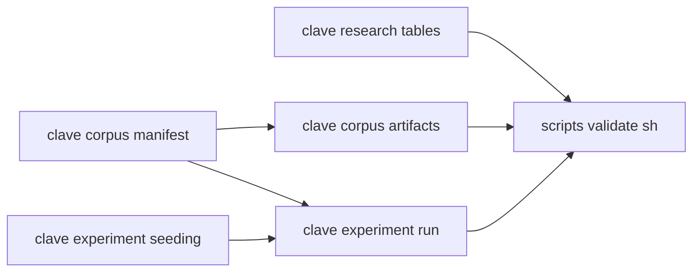

# Design Document

## Overview

This design stands up CLAVE's Python platform: the toolchain, a checksum-backed
corpus manifest, a run record, a determinism rule, and the research document
checker v0.1.0 deferred to this step.

It is the first executable code the repository owns, so its conventions are
inherited by everything after it. The design therefore spends effort on the
package layout and the gate wiring, which are cheap now and expensive to change
once four other specs depend on them.

The core is framework-agnostic on purpose. PyTorch is the framework v0.1.0
chose and it is declared as an optional dependency, but no module in the core
imports it. That keeps the platform testable without a heavy install, keeps the
gate fast, and means a later change of framework does not invalidate the
manifest, the run record, or the determinism machinery.

### Goals

- Fix the Python layout, lint, type and test configuration once.
- Make every corpus artifact resolve by digest, so a silent upstream swap is an
  error rather than a difference in somebody's numbers.
- Make a run self-describing: seed, configuration, inputs, environment.
- Define reproducible numerically and prove it with a test.
- Enforce the research table schemas that v0.1.0 specified and deferred.

### Non-Goals

- Training anything, downloading a large corpus, or touching a GPU.
- Wrapping PyTorch. v0.7.0 does that.
- A dataset abstraction. v0.6.0 owns that and would inherit guesses made here.

## Boundary Commitments

### This Spec Owns

- `pyproject.toml`, the `src/clave/` package, and the `tests/` tree.
- The manifest format, its parsing, and its validation rules.
- Artifact verification and the record-digest path.
- The run record schema and its serialization.
- The seeding entry point and the stated tolerance.
- The research document checker.
- The Python section of `scripts/validate.sh`.

### Out of Boundary

- **PyTorch integration.** Declared as an optional dependency, imported nowhere
  in the core. v0.7.0 owns it.
- **Dataset and dataloader abstractions.** v0.6.0.
- **Network download of large corpora.** The platform verifies and records; an
  operator fetches. A gate that downloads gigabytes is not a gate.
- **GPU code paths.** No accelerator has been confirmed, so none is written.

### Allowed Dependencies

| Dependency | Direction | Criticality | Note |
|---|---|---|---|
| `standards/guidelines/languages/py.md` | Inbound | P0 | Sets src layout, ruff, mypy strict, pytest, coverage floor |
| `scripts/validate.sh` | Outbound | P0 | Gains a Python chain; remains the only gate |
| `docs/research/*.md` | Inbound | P1 | Checked, never written by the platform |
| Python standard library | External | P0 | `tomllib` and `hashlib` carry the manifest and digests with no third-party dependency |

### Revalidation Triggers

- The house Python standards change their layout or coverage floor.
- v0.7.0 introduces PyTorch into the core, which would make the framework-free
  claim false and require re-testing determinism under torch.
- A research document gains a table, which the checker must learn.
- An accelerator is confirmed, which would add a device-dependent path to the
  determinism rule.

## Architecture

### Architecture Pattern and Boundary Map

Three independent modules under one package, sharing only the standard library.
Dependency direction runs left to right and never back.



`clave.research` shares nothing with the corpus and experiment modules. It lives
in the same package because it is gated by the same toolchain, not because it is
related.

### Technology Stack

| Layer | Tool | Role |
|---|---|---|
| Package | Python 3.12, `src/` layout | The platform |
| Manifest | TOML through `tomllib` | Standard library since 3.11, read-only, which is all the manifest needs |
| Digests | `hashlib`, SHA-256 | Standard library |
| Run record | JSON | Readable without executing project code, satisfying 4.4 |
| Lint | `ruff` | House standard |
| Types | `mypy --strict` | House standard |
| Tests | `pytest` with `pytest-cov` | House standard |
| Framework | PyTorch, optional extra | Declared, imported nowhere in the core |

TOML over YAML for the manifest is a deliberate deviation from FRET's YAML
convention. FRET's configs are edited constantly by humans tuning gains; a
manifest is append-mostly and machine-verified, and `tomllib` removes a runtime
dependency from the one component the gate cannot do without.

## File Structure Plan

```
pyproject.toml
corpora/manifest.toml
corpora/fixtures/smoke.csv
src/clave/__init__.py
src/clave/corpus/__init__.py
src/clave/corpus/manifest.py
src/clave/corpus/artifacts.py
src/clave/experiment/__init__.py
src/clave/experiment/seeding.py
src/clave/experiment/run.py
src/clave/research/__init__.py
src/clave/research/tables.py
src/clave/cli.py
tests/corpus/manifest_test.py
tests/corpus/artifacts_test.py
tests/experiment/seeding_test.py
tests/experiment/run_test.py
tests/research/tables_test.py
```

| File | Status | Responsibility |
|---|---|---|
| `pyproject.toml` | New | Package metadata, dependencies, ruff, mypy, pytest, coverage |
| `corpora/manifest.toml` | New | The committed manifest, one entry per artifact |
| `corpora/fixtures/smoke.csv` | New | A small committed fixture with a real digest, so the whole path is testable without a large download |
| `src/clave/corpus/manifest.py` | New | Manifest parsing and validation |
| `src/clave/corpus/artifacts.py` | New | Local verification and the record-digest path |
| `src/clave/experiment/seeding.py` | New | The single seeding entry point and the tolerance constant |
| `src/clave/experiment/run.py` | New | Run record construction and serialization |
| `src/clave/research/tables.py` | New | Research document table checker |
| `src/clave/cli.py` | New | Command entry points the gate calls |
| `scripts/validate.sh` | Modified | Gains a Python chain, skipped when no `pyproject.toml` exists |

### Modified Files

`scripts/validate.sh` only.

## Components and Interfaces

| Component | Intent | Requirements |
|---|---|---|
| Toolchain configuration | Fix layout, lint, types, tests, coverage | 1.1, 1.2, 1.5 |
| Gate wiring | Run the chain, skip when absent | 1.3, 1.4 |
| Manifest | Describe artifacts by digest | 2.1, 2.2, 2.3, 2.4 |
| Artifact verification | Refuse silently changed data | 3.1, 3.2, 3.3, 3.4 |
| Run record | Make a result traceable to its inputs | 4.1, 4.2, 4.3, 4.4, 4.5 |
| Seeding and tolerance | Define reproducible numerically | 5.1, 5.2, 5.3, 5.4 |
| Research checker | Enforce the v0.1.0 table schemas | 6.1, 6.2, 6.3, 6.4 |

### Manifest

An artifact entry carries a name, a source location, and an optional digest. A
missing digest means unverified, which is a state the type expresses rather than
a convention callers remember, satisfying 2.2.

Validation rejects a duplicate name and a malformed entry, naming the offender,
satisfying 2.3. Nothing in the format admits inline binary content, satisfying
2.4.

### Artifact verification

Three outcomes, expressed as distinct values rather than as a boolean with a
message: verified, digest mismatch, and unverified-entry. `available` is true
only for verified, satisfying 3.1, 3.2 and 3.3.

Recording a digest computes it from local bytes and returns it for the caller to
review. It does not write the manifest, satisfying 3.4. A tool that silently
updates the file it is checking against provides no guarantee at all.

### Run record

Carries seed, configuration digest, artifact names with their digests,
interpreter version, and dependency versions, satisfying 4.1, 4.2 and 4.3.
Serialized as JSON, satisfying 4.4. Construction rejects an artifact name absent
from the manifest, satisfying 4.5.

The configuration digest is taken over a canonical serialization, so key order
cannot make two identical configurations look different.

### Seeding and tolerance

One entry point seeds every source the platform controls, satisfying 5.1. It
seeds the standard library and NumPy, and seeds PyTorch only if it is importable,
so the core carries no hard dependency.

The tolerance is a module constant, satisfying 5.3. Two runs at the same seed
compare equal within it, satisfying 5.2, and a test confirms a different seed
changes the result, satisfying 5.4, because a determinism test that passes for a
constant function proves nothing.

### Research checker

Parses the tables named in a per-document schema declaration, checks headers
exactly, checks for empty cells naming row and column, and checks verdicts
against a closed vocabulary, satisfying 6.1, 6.2 and 6.3. A missing document is
skipped rather than failing, satisfying 6.4, so the gate stays green on a clone
that has not reached v0.1.0.

## Error Handling

| Condition | Response |
|---|---|
| Malformed or duplicate manifest entry | Raise a manifest error naming the entry, per 2.3 |
| Digest mismatch on a local artifact | Return a mismatch status; never available, per 3.2 |
| Unverified entry without explicit opt-in | Return an unverified status; never available, per 3.3 |
| Run references an unknown artifact | Raise before the run is recorded, per 4.5 |
| Research table header drift | Fail the gate naming the document and table, per 6.1 |
| Checked document absent | Skip, per 6.4 |

Every error type derives from one package base exception, as the house Python
standards require, so a caller can catch the package rather than each error.

## Testing Strategy

Derived from the acceptance criteria, not from generic patterns.

| Test | Proves |
|---|---|
| Manifest round-trips a valid file | 2.1 |
| Entry without a digest reports unverified | 2.2 |
| Duplicate name raises, naming the entry | 2.3 |
| Matching bytes report verified and available | 3.1 |
| Mutated bytes report mismatch and not available | 3.2 |
| Unverified entry is not available without opt-in | 3.3 |
| Recording a digest returns it and leaves the manifest untouched | 3.4 |
| Run record carries seed, config digest, artifacts, environment | 4.1, 4.2, 4.3 |
| Run record reloads from JSON without importing project code | 4.4 |
| Unknown artifact raises before recording | 4.5 |
| Same seed twice produces metrics within tolerance | 5.2, 5.3 |
| Different seed produces metrics outside tolerance | 5.4 |
| Header drift fails, naming document and table | 6.1 |
| Empty cell fails, naming row and column | 6.2 |
| Verdict outside the vocabulary fails | 6.3 |
| Absent document skips | 6.4 |

Coverage is gated at the house floor. The smoke fixture is committed, small, and
carries a real digest, so the verification path is exercised end to end without
a network call.

## Requirements Traceability

| Requirement | Component | Contract |
|---|---|---|
| 1.1 | Toolchain configuration | `src/clave/`, `tests/` mirroring it |
| 1.2 | Toolchain configuration | One `pyproject.toml` |
| 1.3 | Gate wiring | Python chain in `validate.sh` |
| 1.4 | Gate wiring | Conditional on `pyproject.toml` |
| 1.5 | Toolchain configuration | Coverage floor |
| 2.1 | Manifest | Name, source, digest |
| 2.2 | Manifest | Absent digest is unverified |
| 2.3 | Manifest | Duplicate and malformed rejected by name |
| 2.4 | Manifest | No inline binary |
| 3.1 | Artifact verification | Verified status |
| 3.2 | Artifact verification | Mismatch status |
| 3.3 | Artifact verification | Unverified status |
| 3.4 | Artifact verification | Record returns, does not write |
| 4.1 | Run record | Seed, config, artifacts, environment |
| 4.2 | Run record | Canonical configuration digest |
| 4.3 | Run record | Interpreter and dependency versions |
| 4.4 | Run record | JSON |
| 4.5 | Run record | Unknown artifact rejected |
| 5.1 | Seeding | Single entry point |
| 5.2 | Seeding | Same seed within tolerance |
| 5.3 | Seeding | Tolerance is a constant |
| 5.4 | Seeding | Different seed differs |
| 6.1 | Research checker | Exact header |
| 6.2 | Research checker | Empty cell named |
| 6.3 | Research checker | Closed vocabulary |
| 6.4 | Research checker | Absent document skipped |

## Open Questions and Risks

- **No large corpus is fetched here**, so the manifest carries unverified
  entries for the shortlisted corpora until an operator fetches them and records
  their digests. That is the designed behavior, and it means v0.3.0 proves the
  mechanism rather than the data.
- **Determinism is proven on CPU with NumPy only.** PyTorch and any accelerator
  introduce their own nondeterminism, which v0.7.0 has to re-establish. The
  tolerance constant is the place that will need revisiting.
- **TOML for the manifest diverges from FRET's YAML.** Recorded above with its
  reason; a reviewer who disagrees should say so now rather than after v0.6.0
  depends on it.
