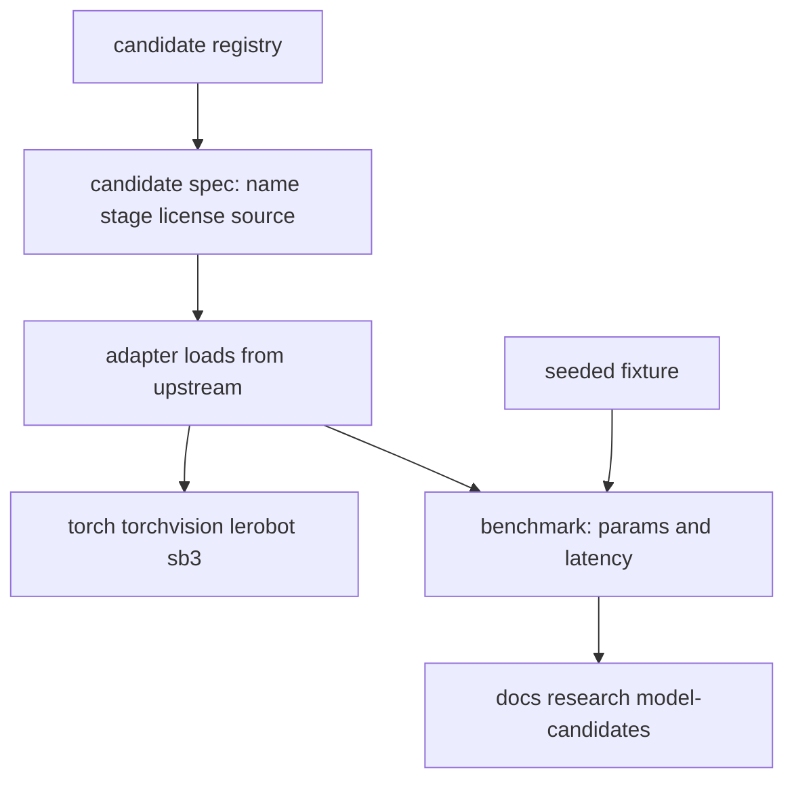

# Design Document

## Overview

This design puts every shortlisted architecture behind one interface and
measures what it costs on the hardware this project actually has. It does not
select a winner; v0.7.0 and v0.8.0 do that from training results rather than
from load-time cost.

The interface is the durable half. v0.7.0 trains against it and v0.9.0 loads a
trained policy through it, so it has to hide four libraries' conventions without
letting any one architecture's assumptions set its shape.

Heavy dependencies stay optional and are imported lazily. The gate runs on a
machine with none of them installed, and the candidate tests skip rather than
fail there.

### Goals

- One interface satisfied by every candidate, describable without loading.
- An adapter per advancing architecture, loading from upstream rather than from
  a reimplementation.
- Measured parameter counts and single-frame latency, with warm-up discarded and
  spread reported.
- A report that puts each measurement beside the v0.1.2 estimate it replaces.

### Non-Goals

- Training, fine-tuning, or any accuracy claim.
- Choosing the architecture CLAVE ships.
- Making the gate depend on torch.

## Boundary Commitments

### This Spec Owns

- `clave.candidates`: the interface, the registry, the adapters, the fixture,
  and the benchmark.
- The `bench-candidates` command.
- `docs/research/model-candidates.md`.

### Out of Boundary

- **Training loops and optimizers.** v0.7.0.
- **Accuracy and any metric derived from labels.** v0.8.0.
- **Corpus fetching.** v0.3.0 owns the manifest; no corpus is read here.
- **The v0.1.2 shortlist itself.** Measurements are reported back to it; the
  verdicts are not rewritten from here.

### Allowed Dependencies

| Dependency | Direction | Criticality | Note |
|---|---|---|---|
| `docs/research/training-infrastructure-review.md` | Inbound | P0 | Supplies which architectures advance |
| `docs/waste-taxonomy.md` | Inbound | P0 | Supplies the class count an output head is sized to |
| `torch`, `torchvision` | External | P1 | Optional extra, imported lazily |
| `lerobot`, `diffusers` | External | P1 | Optional extra, carries ACT and Diffusion Policy |
| `stable-baselines3`, `gymnasium` | External | P1 | Optional extra, carries PPO |
| `clave.experiment.seeding` | Inbound | P0 | The fixture is seeded through the existing entry point |

### Revalidation Triggers

- An accelerator becomes available, which invalidates every latency figure.
- The v0.1.2 shortlist changes, adding or removing an adapter.
- The taxonomy changes its class count, resizing every perception output head.
- An upstream library changes its policy construction API.

## Architecture

### Architecture Pattern and Boundary Map

A registry of descriptions, each able to load a model on demand. Description and
loading are separate so the registry is inspectable with no heavy dependency
present, which is what keeps the gate independent of torch.



The registry holds specs, not models. Nothing imports torch until an adapter is
asked to load.

### Technology Stack

| Layer | Tool | Role |
|---|---|---|
| Perception | `torchvision` | Faster R-CNN MobileNetV3-Large FPN, ResNet-50 |
| Perception | `sam2` | SAM 2, used zero-shot |
| Policy | `lerobot` | ACT and Diffusion Policy, upstream implementations |
| Policy | `stable-baselines3` | PPO policy network |
| Policy | in-project | Behavior cloning baseline, which has no upstream |
| Fixture | `numpy` through `clave.experiment.seeding` | Deterministic frames without a committed binary |

## File Structure Plan

```
src/clave/candidates/__init__.py
src/clave/candidates/base.py
src/clave/candidates/fixture.py
src/clave/candidates/bench.py
src/clave/candidates/perception.py
src/clave/candidates/policy.py
src/clave/candidates/registry.py
tests/candidates/base_test.py
tests/candidates/fixture_test.py
tests/candidates/registry_test.py
tests/candidates/bench_test.py
docs/research/model-candidates.md
```

| File | Status | Responsibility |
|---|---|---|
| `base.py` | New | `CandidateSpec`, `Stage`, `LoadResult`, and the load protocol |
| `fixture.py` | New | Deterministic frames and states from a seed |
| `bench.py` | New | Warm-up, repetition, latency statistics, parameter count |
| `perception.py` | New | Adapters for the perception candidates |
| `policy.py` | New | Adapters for the policy candidates |
| `registry.py` | New | The list of shortlisted candidates |
| `docs/research/model-candidates.md` | New | The measured report |
| `src/clave/cli.py` | Modified | Gains `bench-candidates` |
| `pyproject.toml` | Modified | Optional extras for the candidate libraries |

## Components and Interfaces

| Component | Intent | Requirements |
|---|---|---|
| Candidate spec | Describe without loading | 1.1, 1.2, 1.3 |
| Lazy loading | Keep torch out of import time | 1.4, 1.5 |
| Adapters | Load from upstream | 2.1, 2.2, 2.3, 2.4 |
| Fixture | Drive every candidate reproducibly | 3.5 |
| Benchmark | Measure rather than estimate | 3.1, 3.2, 3.3, 3.4, 3.6 |
| Report | Put measurements beside estimates | 4.1, 4.2, 4.3, 4.4, 4.5 |

### Candidate spec and loading

A spec carries name, stage, license, source, and the dependency its adapter
needs. It is a plain value, constructed without importing anything heavy, which
satisfies 1.3 and 1.4.

Loading returns a result rather than raising: loaded with a model, or unavailable
with the missing dependency named, satisfying 1.5. An adapter that fails for any
other reason records the failure and does not substitute a different candidate,
satisfying 2.4.

### Fixture

Frames and states are generated from a seed through
`clave.experiment.seeding`, so no binary is committed and two benchmark runs see
identical inputs. This satisfies 3.5 and reuses v0.3.0 rather than adding a
second source of randomness.

### Benchmark

Warm-up iterations run and are discarded before timing, satisfying 3.3. The
reported figure carries the repetition count and the spread, satisfying 3.4, so
one unlucky sample is visible rather than averaged away. Hardware and thread
count are recorded alongside, satisfying 3.6.

Latency is measured for a single frame, which is CLAVE's actual access pattern:
a conveyor produces frames one at a time and batching across objects is not
available.

## Data Models

- **CandidateSpec**: name, stage, license, source, required dependency.
- **LoadResult**: either a model with its spec, or a spec with a reason it is
  unavailable.
- **BenchResult**: spec, parameter count, median latency, spread, repetitions,
  warm-up count, thread count.

**Invariants:**

1. A registry entry is constructible with no optional dependency installed.
2. A `BenchResult` exists only for a candidate that loaded.
3. Latency figures carry their repetition count.

## Error Handling

| Condition | Response |
|---|---|
| Optional library absent | Return unavailable naming the dependency, per 1.5 |
| Adapter raises while building | Record the failure and its reason, per 2.4 |
| Forward pass raises | Record the candidate as loaded but unbenchmarkable |
| No candidate loads | Report an empty table rather than failing the gate |

## Testing Strategy

| Test | Proves |
|---|---|
| Registry lists every shortlisted candidate | 2.1 |
| Specs are readable with no heavy dependency importable | 1.3, 1.4 |
| A spec reports its stage | 1.2 |
| A missing dependency yields unavailable, named | 1.5 |
| The fixture is identical across two seeded runs | 3.5 |
| The fixture differs across two seeds | 3.5 |
| Benchmark discards warm-up | 3.3 |
| Benchmark reports repetitions and spread | 3.4 |
| Parameter count matches a known model | 3.1 |

Tests touching a heavy library use `pytest.importorskip`, so the gate passes on
a machine with none installed. That is the specified behavior rather than a
weakening: the platform's own contract is that these are optional.

## Requirements Traceability

| Requirement | Component | Contract |
|---|---|---|
| 1.1 | Candidate spec | name, stage, license, source |
| 1.2 | Candidate spec | `Stage` |
| 1.3 | Candidate spec | Constructible without loading |
| 1.4 | Lazy loading | No heavy import at package import |
| 1.5 | Lazy loading | Unavailable names the dependency |
| 2.1 | Registry | One entry per advancing architecture |
| 2.2 | Adapters | Upstream construction |
| 2.3 | Adapters | Output sized to the taxonomy class count |
| 2.4 | Adapters | Failure recorded, no substitution |
| 3.1 | Benchmark | Parameter count |
| 3.2 | Benchmark | Measured latency |
| 3.3 | Benchmark | Warm-up discarded |
| 3.4 | Benchmark | Repetitions and spread |
| 3.5 | Fixture | Seeded generation |
| 3.6 | Benchmark | Hardware and threads recorded |
| 4.1 | Report | `docs/research/` |
| 4.2 | Report | Measurement beside estimate |
| 4.3 | Report | Contradicted verdicts named |
| 4.4 | Report | No training, no accuracy |
| 4.5 | Report | Load failures recorded |

## Open Questions and Risks

- **Latency measured here is CPU-only**, which is CLAVE's current worst case and
  may not be its deployment case. Every figure needs re-measuring if an
  accelerator appears.
- **SAM 2 carries the largest uncertainty.** It advanced because it needs no
  training, and its CPU inference latency is the number most likely to
  disqualify it against a conveyor budget.
- **A measurement may contradict a v0.1.2 verdict.** The report names the
  affected verdict rather than editing the review, so the two documents disagree
  visibly until somebody resolves it.
