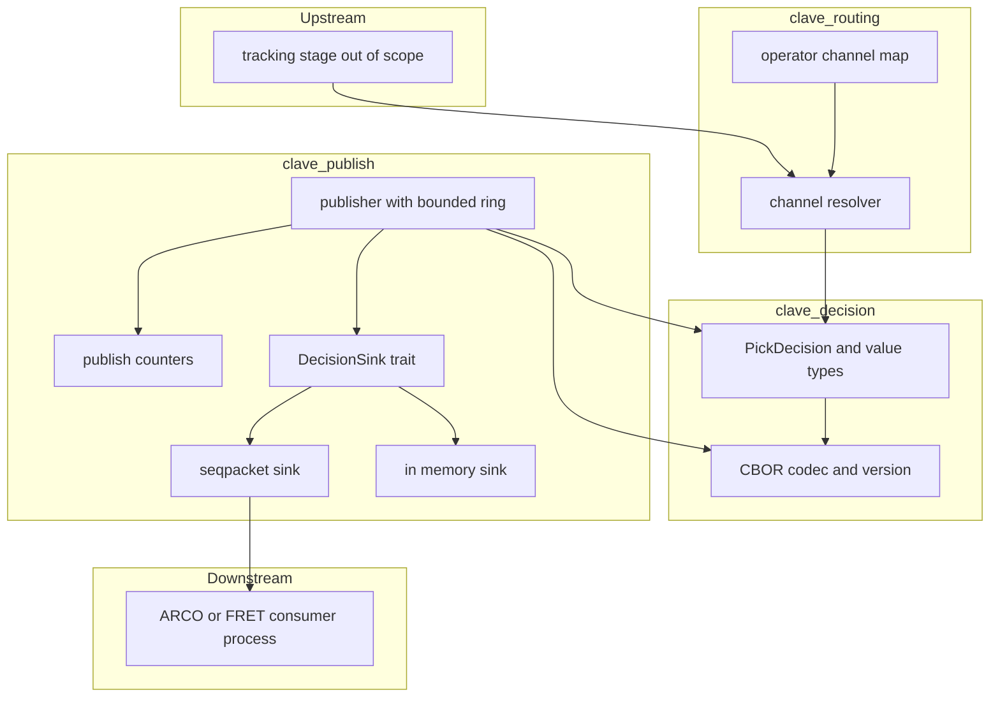
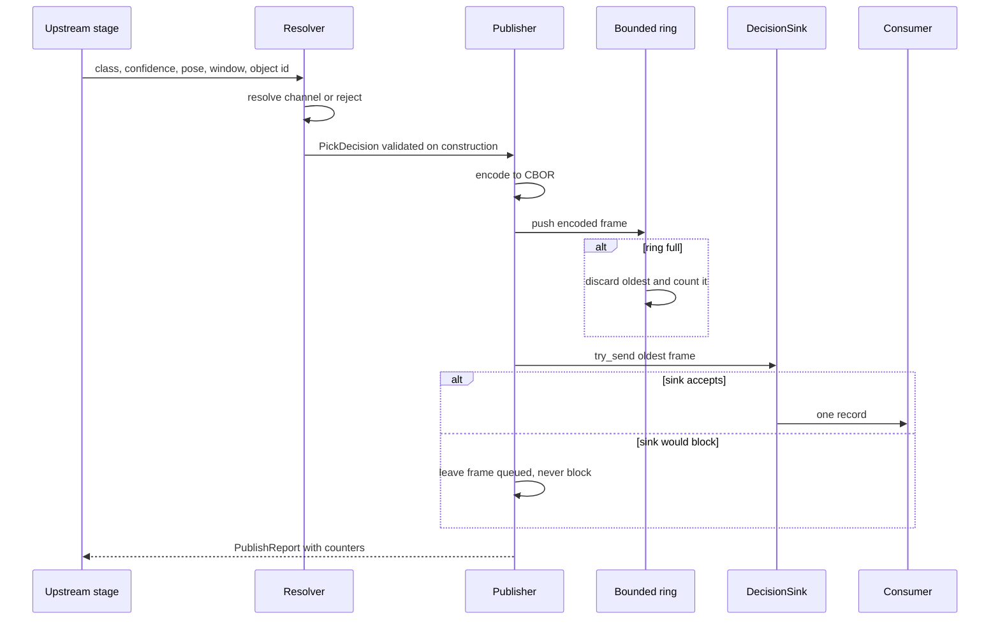
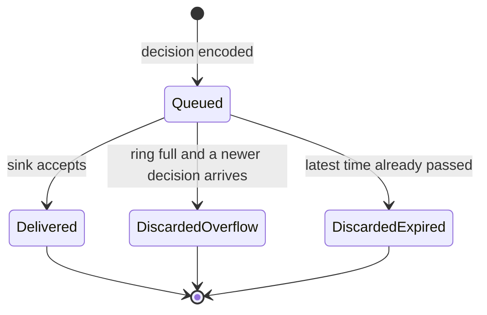

# Technical Design

## Overview

**Purpose**: This feature delivers the pick decision contract to the
projects that move the effector, so that a consumer receives everything
needed to reach for one object without re-deriving what CLAVE already
estimated.

**Users**: ARCO and FRET consume decisions. A line operator reads the
counters this design exposes to tell a healthy line from an overloaded
one. A contributor to this repository meets the workspace and the gates
that land with the first code.

**Impact**: The repository holds no application code, so this design
establishes the workspace, the dependency direction, and the first three
crates, and switches on the Rust half of the existing validation script.

### Goals

- A decision type whose invalid states are unrepresentable, carrying the
  class, the resolved channel, the predicted pose, the reachability
  window, the confidence, and the object identity.
- A versioned wire format that a consumer implements from a published
  schema, without reading this repository.
- Delivery that never stalls the pipeline, keeps order, and reports what
  it discarded.
- A measured publication budget rather than an assumed one.

### Non-Goals

- Capture, inference, and tracking, which produce the estimates a decision
  reports.
- Motion planning and effector execution.
- A second transport implementation. The seam exists because the tests
  need a fake and the measurements may later demand shared memory, not
  because two transports are planned now.
- Multi-machine delivery. The time reference chosen here is machine-local.

## Boundary Commitments

### This Spec Owns

- The definition, validation, and versioning of a pick decision.
- The encoding of a decision on the wire, its published schema, and its
  golden vectors.
- The resolution from a material class and a confidence to a channel,
  including both routes to the reject channel.
- The bounded outbound queue, its discard-oldest policy, and its counters.
- The publication latency budget and the benchmark that enforces it.
- The Cargo workspace, its lint tiers, its release profile, and the Rust
  half of `scripts/validate.sh`.

### Out of Boundary

- Producing the estimates a decision carries. The pose, the window, the
  confidence, and the object identity arrive from stages this spec does
  not own, and this spec neither computes nor corrects them.
- Minting object identities. The publisher carries the identity it is
  given and never rewrites it.
- The physical channel layout and the class-to-channel mapping, which the
  line operator supplies as configuration.
- Whatever a consumer does after receiving a decision.
- Reconnection strategy for a consumer that disappears. This design states
  what the producer does when no consumer is reachable and stops there.

### Allowed Dependencies

- `clave-routing` and `clave-publish` may depend on `clave-decision`.
  Nothing depends upward, and `clave-routing` and `clave-publish` do not
  depend on each other.
- Third-party dependencies: `serde` for derivation, `cbor4ii` for the
  encoding, `thiserror` for error types, and `criterion` as a development
  dependency. Nothing else without a stated reason.
- The standard library supplies the socket. No messaging library, no
  middleware, no C toolchain.

### Revalidation Triggers

- Any change to the fields of a decision or to the set of material
  classes, which raises the contract version and invalidates every golden
  vector.
- Any change to the time reference, which today is the machine-local
  monotonic clock. Moving a consumer to another machine breaks it.
- Any change to the overflow policy or to the meaning of a counter.
- A second sink implementation, which changes what the conformance suite
  has to prove.
- Growth of the encoded message beyond the size the transport choice
  assumes.

## Architecture

### Architecture Pattern and Boundary Map



**Architecture Integration**:

- Selected pattern: ports and adapters, narrowed to one port. The discard
  policy and the counters sit in front of the port so that every adapter
  inherits one policy and one counter, which a test asserts on with no
  syscalls.
- Domain boundaries: the contract crate holds data and no policy, routing
  holds policy and no input or output, publishing holds input and output
  and no estimation.
- Dependency direction: `clave-decision` then `clave-routing` and
  `clave-publish`. Each imports only to its left. A violation is an error,
  not a preference.
- New components rationale: three crates because the wire type, the
  routing policy, and the delivery mechanism have three separate reasons
  to change, and a reviewer should see one change without reading the
  others.
- Steering compliance: `clave-decision` and `clave-publish` sit on the
  capture-to-decision path and take the hardened lint tier from
  `languages/rs.md`. All three crates declare `#![forbid(unsafe_code)]`.

### Technology Stack

| Layer | Choice / Version | Role in Feature | Notes |
| --- | --- | --- | --- |
| Language | Rust edition 2024, resolver 3 | Everything in this feature | Toolchain pinned in `rust-toolchain.toml` |
| Serialization | `cbor4ii` 1.2.3, MIT | Encodes and decodes a decision | Fixed width floats; its output decodes in any RFC 8949 library |
| Derivation | `serde` 1, MIT OR Apache-2.0, `derive` feature | Field names and enum variant names on the wire | `default-features = false` |
| Errors | `thiserror` 2, MIT OR Apache-2.0 | Error enums in every crate | Library crates never return a boxed error |
| Messaging | `std::os::unix::net`, SOCK_SEQPACKET | Carries an encoded decision to one consumer | No third-party transport dependency |
| Schema | CDDL, RFC 8610 | The artifact a consumer implements against | Committed, plus golden vectors |
| Benchmarks | `criterion`, development dependency, version pinned when the task lands | Reports p99 publication latency | Fails above the budget. The version is unverified here and is checked against crates.io at implementation time |

## File Structure Plan

### Directory Structure

```
crates/
├── clave-decision/            # The contract. No input or output, no policy
│   ├── src/
│   │   ├── lib.rs             # Crate docs, re-exports, CONTRACT_VERSION
│   │   ├── decision.rs        # PickDecision and its validating constructor
│   │   ├── material.rs        # MaterialClass, the fixed set
│   │   ├── pose.rs            # PickPose, BeltPoint, Yaw
│   │   ├── window.rs          # PickWindow, MonotonicNanos
│   │   ├── ids.rs             # ChannelId, ObjectId, Confidence
│   │   ├── codec.rs           # CBOR encode and decode, version rejection
│   │   └── error.rs           # ContractError
│   ├── contract/
│   │   ├── pick-decision.cddl # The schema a consumer implements against
│   │   └── vectors/v1/        # Golden vectors, hex bytes plus expected values
│   ├── tests/
│   │   ├── round_trip.rs      # 2.2
│   │   ├── golden_vectors.rs  # 2.5, guards encoder drift
│   │   ├── version.rs         # 2.1, 2.3, 2.6
│   │   └── invariants.rs      # 1.3, 1.4
│   └── benches/codec.rs       # Encode cost, feeds the 4.1 budget
├── clave-routing/             # Policy. Depends on clave-decision only
│   ├── src/
│   │   ├── lib.rs
│   │   ├── channel_map.rs     # Operator-supplied mapping, validated on load
│   │   └── resolver.rs        # Class and confidence to channel or reject
│   └── tests/resolution.rs    # 1.5, 1.6, 1.7
└── clave-publish/             # Delivery. Depends on clave-decision only
    ├── src/
    │   ├── lib.rs
    │   ├── publisher.rs       # Bounded ring, discard oldest, expiry check
    │   ├── sink.rs            # DecisionSink trait, SendOutcome
    │   ├── uds.rs             # SeqpacketSink over std
    │   ├── fake.rs            # InMemorySink, behind a test feature
    │   ├── counters.rs        # PublishCounters
    │   └── error.rs           # PublishError
    ├── tests/
    │   ├── conformance.rs     # Generic over DecisionSink, 3.1, 3.2
    │   └── overflow.rs        # 3.3, 3.4, 3.5, 3.6
    └── benches/publish.rs     # 4.1, 4.3, 4.4
```

Every file above is new. `contract/vectors/v1/` grows one directory per
contract version and existing directories are never edited, because a
vector that changes is a vector that proves nothing.

### Modified Files

- `Cargo.toml` at the repository root: created as the workspace manifest,
  carrying `[workspace.package]`, `[workspace.lints]` at the baseline
  tier, `[workspace.dependencies]`, and a release profile with
  `overflow-checks = true`.
- `rust-toolchain.toml`: created, pinning the channel and the components
  the gate needs.
- `deny.toml`: created at the workspace root for `cargo deny check`.
- `rustfmt.toml`: created, edition 2024 and `max_width = 100`.
- `scripts/validate.sh`: no edit required. It already runs the full Rust
  chain as soon as a `Cargo.toml` exists at the root, which is the
  behavior Requirement 5.1 describes.
- `.github/workflows/ci.yml`: no edit required. Its Rust steps are guarded
  by `hashFiles('Cargo.toml')` and activate on their own.

## System Flows

### Publishing one decision



### Overflow and expiry



A frame leaves the queue in exactly one of three ways, and each of the
three increments a distinct counter. Discarding by expiry is checked
immediately before a send rather than on a timer, so the queue needs no
clock thread and the check costs one comparison.

## Requirements Traceability

| Requirement | Summary | Components | Interfaces | Flows |
| --- | --- | --- | --- | --- |
| 1.1 | Decision carries the full payload | PickDecision | `PickDecision::new` | Publishing |
| 1.2 | Class from a fixed set | MaterialClass | `MaterialClass` | Publishing |
| 1.3 | Pose predicted for the window | PickPose, PickDecision | `PickDecision::new` invariant | Publishing |
| 1.4 | Window is earliest and latest | PickWindow | `PickWindow::new` | Publishing |
| 1.5 | Channel resolved from operator mapping | Resolver, ChannelMap | `Resolver::resolve` | Publishing |
| 1.6 | Low confidence to reject channel | Resolver | `Resolver::resolve` | Publishing |
| 1.7 | Unmapped class to reject channel | Resolver, ChannelMap | `Resolver::resolve` | Publishing |
| 1.8 | No decision before resolution | Resolver, Publisher | `Routed` enum | Publishing |
| 1.9 | Stable object identity | ObjectId, Publisher | `PickDecision::object` | Publishing |
| 2.1 | Version in every decision | Codec | `CONTRACT_VERSION` in `lib.rs` | Publishing |
| 2.2 | Lossless round trip | Codec | `encode`, `decode` | Publishing |
| 2.3 | Shape or class change raises version | Codec, golden vectors | `CONTRACT_VERSION` | Publishing |
| 2.4 | Fields documented with unit, frame, time reference | CDDL schema | `contract/pick-decision.cddl` | Publishing |
| 2.5 | Worked example published | Golden vectors | `contract/vectors/v1/` | Publishing |
| 2.6 | Stated behavior on unknown version | Codec, CDDL schema | `decode` rejection | Publishing |
| 3.1 | Exactly once while the consumer keeps up | Publisher, DecisionSink | `Publisher::publish` | Publishing |
| 3.2 | Order preserved | Publisher, SeqpacketSink | `DecisionSink::try_send` | Publishing |
| 3.3 | Discard oldest on a full queue | Publisher, bounded ring | `Publisher::publish` | Overflow |
| 3.4 | Discards counted and readable | PublishCounters | `Publisher::counters` | Overflow |
| 3.5 | No consumer does not stall the pipeline | Publisher, SeqpacketSink | `SendOutcome::WouldBlock` | Overflow |
| 3.6 | Expired window discarded | Publisher | `Publisher::publish` | Overflow |
| 4.1 | 5 ms p99 publication | Publisher, benchmark | `benches/publish.rs` | Publishing |
| 4.2 | Budget documented within the 100 ms budget | Crate documentation | `clave-publish` crate docs | Publishing |
| 4.3 | Benchmark reports p99 | Benchmark | `benches/publish.rs` | Publishing |
| 4.4 | Benchmark fails above budget | Benchmark | `benches/publish.rs` | Publishing |
| 5.1 | Validation script runs the full chain | Workspace manifest | `scripts/validate.sh` | Not applicable |
| 5.2 | CI runs the same script | CI workflow | `.github/workflows/ci.yml` | Not applicable |
| 5.3 | Coverage floor of 80 percent | Workspace manifest | `scripts/validate.sh` | Not applicable |
| 5.4 | Overflow faults rather than wraps | Release profile | `Cargo.toml` profile | Not applicable |
| 5.5 | Broken documentation reference fails the build | Workspace manifest | `scripts/validate.sh` | Not applicable |

## Components and Interfaces

| Component | Crate | Intent | Req Coverage | Key Dependencies | Contracts |
| --- | --- | --- | --- | --- | --- |
| PickDecision | clave-decision | The validated decision and its value types | 1.1, 1.2, 1.3, 1.4, 1.9 | none (P0) | Service, State |
| Codec | clave-decision | CBOR encoding, decoding, and version rejection | 2.1, 2.2, 2.3, 2.6 | cbor4ii (P0) | Service, Event |
| Contract schema | clave-decision | CDDL file and golden vectors a consumer implements against | 2.4, 2.5, 2.6 | none (P1) | Event |
| Resolver | clave-routing | Class and confidence to a channel or the reject channel | 1.5, 1.6, 1.7, 1.8 | ChannelMap (P0) | Service |
| Publisher | clave-publish | Bounded ring, discard policy, expiry check, counters | 3.1, 3.3, 3.4, 3.5, 3.6, 4.1 | Codec (P0), DecisionSink (P0) | Service, State |
| DecisionSink | clave-publish | The transport seam, non-blocking by contract | 3.1, 3.2, 3.5 | none (P0) | Service |
| SeqpacketSink | clave-publish | The one real transport, a Unix SOCK_SEQPACKET socket | 3.2, 3.5, 4.1 | std::os::unix::net (P0) | Service |
| Workspace and gates | workspace root | Lints, profile, dependency policy, the Rust gate | 5.1, 5.2, 5.3, 5.4, 5.5 | cargo tooling (P0) | Batch |

### Contract layer

#### PickDecision

| Field | Detail |
| --- | --- |
| Intent | Hold one decision in a state where an invalid combination cannot be constructed |
| Requirements | 1.1, 1.2, 1.3, 1.4, 1.9 |

**Responsibilities and Constraints**

- Owns the shape of a decision and the invariants that bind its fields
  together. Owns no policy and performs no input or output.
- Every field is a newtype or an enumeration rather than a bare primitive,
  so a channel cannot be passed where an object identity belongs.
- Carries the object identity it is given. It never mints one and never
  rewrites one, which is how 1.9 holds at this boundary.

**Dependencies**

- Inbound: Resolver supplies the channel (P0); upstream stages supply the
  pose, window, confidence, and identity (P0, out of boundary).
- Outbound: none.

**Contracts**: Service [x] / API [ ] / Event [ ] / Batch [ ] / State [x]

##### Service Interface

```rust
pub const CONTRACT_VERSION: u16 = 1;

pub enum MaterialClass { Glass, Paper, Cardboard, Plastic, Metal, Trash }

pub struct ChannelId(u16);
pub struct ObjectId(u64);
pub struct Confidence(f32);
pub struct MonotonicNanos(i64);

pub struct BeltPoint { x_meters: f64, y_meters: f64, z_meters: f64 }
pub struct PickPose { point: BeltPoint, yaw_radians: f64, reference_time: MonotonicNanos }
pub struct PickWindow { earliest: MonotonicNanos, latest: MonotonicNanos }

pub struct PickDecision { /* version, object, class, channel, pose, window, confidence */ }

impl PickDecision {
    pub fn new(
        object: ObjectId,
        class: MaterialClass,
        channel: ChannelId,
        pose: PickPose,
        window: PickWindow,
        confidence: Confidence,
    ) -> Result<Self, ContractError>;
}
```

- Preconditions: none. The constructor validates rather than trusting.
- Postconditions: `window.earliest <= window.latest`; `confidence` lies in
  0.0 to 1.0 inclusive and is finite; `pose.reference_time` falls inside
  the window, which is what makes 1.3 a checked property rather than a
  comment; `version` equals `CONTRACT_VERSION`.
- Invariants: a constructed value stays valid, since no field is publicly
  mutable and every accessor returns a copy.

**Implementation Notes**

- Integration: `Confidence` holds an `f32` and therefore cannot derive
  `Eq` or `Ord`. Comparison against the routing threshold is the only
  ordering it needs, and `clippy::float_cmp` stays denied, so equality is
  never used on it.
- Validation: `1.3` is enforced by the reference time check. The design
  cannot verify that an upstream estimator actually predicted rather than
  observed, and this is the honest limit of the boundary.
- Risks: a planar pose covers a top-down pick. See the open question on
  six degrees of freedom.

#### Codec

| Field | Detail |
| --- | --- |
| Intent | Move a decision to and from CBOR, and reject an unknown version before anything else is read |
| Requirements | 2.1, 2.2, 2.3, 2.6 |

**Responsibilities and Constraints**

- Writes the version as the first field, so a rejection costs one field
  read.
- Emits fixed-width floats and named fields. Class variants travel as
  their names, not as positional indices.
- Rejects a whole message whose version it does not know, which is what
  makes an unrecognized class impossible in an accepted message rather
  than merely unlikely.

**Dependencies**

- External: `cbor4ii` 1.2.3 (P0). Its output decodes in any RFC 8949
  library, while ciborium output does not decode in cbor4ii. The project
  produces with cbor4ii, so the asymmetry runs in its favor, and the
  golden vectors prove it still does.

**Contracts**: Service [x] / API [ ] / Event [x] / Batch [ ] / State [ ]

##### Service Interface

```rust
pub fn encode(decision: &PickDecision) -> Result<Vec<u8>, ContractError>;
pub fn decode(bytes: &[u8]) -> Result<PickDecision, ContractError>;
```

- Preconditions: `decode` accepts arbitrary bytes, including hostile ones.
- Postconditions: `decode(encode(d))? == d` for every constructible `d`,
  including NaN and infinite coordinates, which is the property JSON could
  not hold.
- Invariants: `encode` never emits a half-width float.

##### Event Contract

- Published: one CBOR record per decision, one record per socket message.
- Ordering: the order the publisher accepted them.
- Idempotency: a decision carries an object identity, so a consumer that
  receives the same identity twice can recognize it. The producer does not
  deduplicate.

### Routing layer

#### Resolver

| Field | Detail |
| --- | --- |
| Intent | Turn a class and a confidence into a channel, or into the reject channel with a reason |
| Requirements | 1.5, 1.6, 1.7, 1.8 |

**Responsibilities and Constraints**

- Holds the only copy of the routing policy. The contract crate has none
  and the publisher has none.
- Validates the operator mapping when it is loaded, not on every object:
  a map without a reject channel is rejected at load.

**Dependencies**

- Inbound: upstream stage (P0, out of boundary).
- Outbound: `clave-decision` for the value types (P0).

**Contracts**: Service [x] / API [ ] / Event [ ] / Batch [ ] / State [ ]

##### Service Interface

```rust
pub struct ChannelMap { /* class to channel, reject channel, threshold */ }

impl ChannelMap {
    pub fn new(
        entries: impl IntoIterator<Item = (MaterialClass, ChannelId)>,
        reject: ChannelId,
        threshold: Confidence,
    ) -> Result<Self, RoutingError>;
}

pub enum Routed { Sorted(ChannelId), Rejected { channel: ChannelId, reason: RejectReason } }
pub enum RejectReason { BelowThreshold, UnmappedClass }

impl Resolver {
    pub fn resolve(&self, class: MaterialClass, confidence: Confidence) -> Routed;
}
```

- Preconditions: the map was validated at construction.
- Postconditions: `resolve` is total. Every class and confidence produces
  a channel, so 1.8 holds because no path returns without a resolution.
- Invariants: confidence is tested against the threshold before the class
  is looked up, so a low-confidence object never reaches a sorted channel
  even when its class is mapped.

### Delivery layer

#### Publisher

| Field | Detail |
| --- | --- |
| Intent | Own the bounded ring, the discard policy, the expiry check, and the counters |
| Requirements | 3.1, 3.3, 3.4, 3.5, 3.6, 4.1 |

**Responsibilities and Constraints**

- Encodes, queues, and hands frames to a sink. Never blocks, on any path.
- A frame leaves the ring in exactly one of three ways, and each
  increments a distinct counter.
- The expiry check happens immediately before a send, so no clock thread
  exists and the check costs one comparison.

**Dependencies**

- Outbound: Codec (P0), DecisionSink (P0), PublishCounters (P1).

**Contracts**: Service [x] / API [ ] / Event [ ] / Batch [ ] / State [x]

##### Service Interface

```rust
pub struct PublishCounters {
    pub published: u64,
    pub delivered: u64,
    pub discarded_overflow: u64,
    pub discarded_expired: u64,
}

pub struct PublishReport { pub delivered: bool, pub counters: PublishCounters }

impl<S: DecisionSink> Publisher<S> {
    pub fn with_capacity(sink: S, capacity: NonZeroUsize) -> Self;
    pub fn publish(&mut self, decision: &PickDecision, now: MonotonicNanos)
        -> Result<PublishReport, PublishError>;
    pub fn counters(&self) -> PublishCounters;
}
```

- Preconditions: capacity is non-zero, which the type enforces rather than
  a runtime check.
- Postconditions: `published` equals `delivered` plus
  `discarded_overflow` plus `discarded_expired` plus whatever remains
  queued. This identity is the property the overflow tests assert.
- Invariants: `publish` performs no blocking call and allocates nothing on
  the steady-state path, since the ring is allocated once at construction.

##### State Management

- State model: a fixed-capacity ring of encoded frames plus four
  monotonically increasing counters.
- Concurrency: a `Publisher` is owned by one stage and is not shared. It
  is `Send` and not `Sync`, so the compiler rejects the shared use that
  would make the counters lie.

#### DecisionSink and SeqpacketSink

| Field | Detail |
| --- | --- |
| Intent | The transport seam, and the single real implementation behind it |
| Requirements | 3.1, 3.2, 3.5, 4.1 |

**Responsibilities and Constraints**

- The trait takes an encoded frame, never a decision, so the schema stays
  on the contract side of the seam and a transport change does not touch
  the message type.
- Non-blocking is a clause of the trait, not an accident of one
  implementation. A sink that blocks converts backpressure into a pipeline
  stall and breaks 3.5.
- The seam is justified by two implementations that exist from the start,
  the socket and the in-memory fake every test runs against, and by the
  measured possibility of a shared-memory second. It is not speculative.

**Dependencies**

- External: `std::os::unix::net` (P0). No third-party transport crate.

**Contracts**: Service [x] / API [ ] / Event [ ] / Batch [ ] / State [ ]

##### Service Interface

```rust
pub enum SendOutcome { Sent, WouldBlock }

pub trait DecisionSink {
    type Error: std::error::Error + Send + Sync + 'static;
    /// Must not block. Returns WouldBlock rather than waiting.
    fn try_send(&mut self, frame: &[u8]) -> Result<SendOutcome, Self::Error>;
}
```

- Preconditions: `frame` is one complete encoded decision.
- Postconditions: `Sent` means the kernel accepted the whole record.
  `WouldBlock` means nothing was written and the caller still owns the
  frame.
- Invariants: a partial record is never delivered, which SOCK_SEQPACKET
  gives for free and a stream socket would not.

**Implementation Notes**

- Integration: the socket is non-blocking. `EAGAIN` maps to `WouldBlock`,
  and a disconnected peer maps to `WouldBlock` rather than an error, so a
  consumer that dies does not take the pipeline with it. That is 3.5.
- Validation: one conformance suite, generic over `DecisionSink`, runs
  against both implementations, so ordering and the discard identity are
  proved per backend rather than assumed.
- Risks: SOCK_SEQPACKET has a maximum record size. See the open question
  on a maximum encoded size.

## Data Models

### Domain Model

One aggregate, the decision, and it is immutable once constructed. There
is no persistence and no transaction: a decision exists from construction
until it is delivered or discarded, and the counters are the only state
that outlives it.

Invariants, all enforced at construction:

- The window is ordered, so `earliest <= latest`.
- The pose reference time falls inside the window.
- Confidence is finite and lies between 0.0 and 1.0 inclusive.
- The version equals the version the crate was built with.

### Data Contracts and Integration

The published artifact is a CDDL file plus a directory of golden vectors
per version. The schema states units, coordinate frame, and time
reference, which is what Requirement 2.4 asks for and what a consumer
needs in order to implement without reading this source.

| Field | Type | Unit and reference |
| --- | --- | --- |
| `version` | uint | Contract version, first field, rejected on mismatch |
| `object` | uint | Tracker identity, stable across decisions for one object |
| `class` | text | Variant name from the fixed set |
| `channel` | uint | Resolved channel, including the reject channel |
| `pose` | map | Belt frame, meters, and yaw in radians |
| `pose.reference_time` | int | Monotonic nanoseconds, inside the window |
| `window` | map | `earliest` and `latest`, monotonic nanoseconds |
| `confidence` | float64 | 0.0 to 1.0 inclusive |

The time reference is the Linux system monotonic clock, shared between
processes on one machine and meaningful within one boot. A consumer on
another machine cannot interpret these timestamps, which is why
multi-machine delivery is a revalidation trigger rather than a feature.

Schema evolution has one rule: any change to the fields or to the class
set raises `CONTRACT_VERSION`, ships a new vector directory, and leaves
existing vector directories untouched. Tolerant reading through serde
`default`, `alias`, or `other` is forbidden in this crate, because it
converts a contract break into a silent default.

## Error Handling

### Error Strategy

Each crate defines one `#[non_exhaustive]` enumeration with `thiserror`
and returns it from every fallible public function. Variants name the
failure rather than the function that produced it. No public signature
returns a boxed error, and no library path panics on anything a caller
could have caused.

### Error Categories and Responses

| Category | Example | Response |
| --- | --- | --- |
| Invalid construction | Window inverted, confidence outside range, pose timed outside the window | `ContractError`, rejected before a decision exists |
| Malformed input | Truncated or hostile bytes at `decode` | `ContractError`, no panic, no allocation proportional to a length field the input chose |
| Version mismatch | A decision from a newer producer | `ContractError::UnknownVersion`, the whole message rejected |
| Misconfiguration | A channel map with no reject channel | `RoutingError`, rejected at load rather than at the first object |
| Transport refusal | Consumer slow, absent, or gone | Not an error. `SendOutcome::WouldBlock`, the frame stays queued, the policy decides |
| Transport fault | The socket is broken in a way retrying cannot fix | `PublishError`, surfaced to the caller without stalling |

Backpressure is deliberately not an error. Treating a slow consumer as a
failure is what leads to a stalled pipeline, and 3.5 forbids that.

### Monitoring

The four counters are the observable surface: `published`, `delivered`,
`discarded_overflow`, and `discarded_expired`. Their identity holds at
every moment, and an operator reading a rising `discarded_overflow` is
reading a line running faster than its consumer. Structured logging of
individual decisions is out of boundary.

## Testing Strategy

### Unit Tests

- Construction rejects an inverted window, a confidence outside range or
  not finite, and a pose timed outside the window (1.3, 1.4).
- `Resolver::resolve` sends a low-confidence object to the reject channel
  even when its class is mapped, and an unmapped class to the same place
  with a different reason (1.6, 1.7).
- `ChannelMap::new` rejects a map with no reject channel.
- The ring discards the oldest frame and increments only that counter
  (3.3, 3.4).

### Integration Tests

- Round trip through `encode` and `decode` for every class variant and for
  edge floats including NaN, infinity, and subnormals (2.2).
- Golden vectors from `contract/vectors/v1/` decode to their expected
  values, which is what catches an encoder that starts emitting
  half-width floats (2.5).
- A decision carrying an unknown version is rejected whole, and no field
  past the version is read (2.1, 2.6).
- The conformance suite, generic over `DecisionSink`, runs against the
  in-memory fake and against a real socket pair, proving order and the
  counter identity for both (3.1, 3.2).
- A consumer that never reads, and a consumer that disconnects mid-stream,
  both leave the publisher running and the counters consistent (3.5).
- A decision whose window closed before the send is discarded as expired,
  not delivered (3.6).

### Property Tests

`proptest` over arbitrary decisions for the round-trip invariant, which is
where the input space is larger than the examples anyone would think to
write, and over arbitrary publish sequences for the counter identity
`published == delivered + discarded_overflow + discarded_expired + queued`.

### Performance Tests

A Criterion benchmark measures publication from the call to `publish`
until the sink accepts, reports p99, and fails above 5 ms (4.1, 4.3, 4.4).
It runs against the real socket, since a benchmark against the fake would
measure nothing that matters.

## Performance and Scalability

The budget is 5 ms at p99 for publication, inside the 100 ms
capture-to-delivery budget, stated in the `clave-publish` crate
documentation (4.2).

One caveat belongs in this document rather than in a footnote. No
published source reports a p99 for local delivery of a small message.
Medians for a Unix socket at this size sit near 4 microseconds one way,
which suggests the transport will spend under 0.1 percent of the budget
and that scheduler wake-up, page faults, and allocator behavior will
dominate the tail. That is a hypothesis the benchmark tests, not a result
this design may claim. Nothing here has been measured on the target board,
and Requirement 4 is not met until it has been.

Scaling is bounded by design: one publisher, one consumer, one machine,
a ring sized at construction. Throughput beyond one consumer is out of
boundary.

## Open Questions and Risks

1. **A maximum encoded size.** The transport choice rests on a message of
   roughly 100 to 300 bytes. If a decision later carries an image crop or
   a mask, the copy-per-message shape that makes a socket cheap becomes
   the thing to tear out. Retiring that risk costs one acceptance
   criterion capping the encoded size, appended as `2.7` under the
   append-only id rule. The approved requirements do not contain it, so
   this is the maintainer's call at the design gate.
2. **Planar pose against six degrees of freedom.** This design carries a
   point and a yaw, which describes a top-down pick. A tilted object, or a
   gripper approaching off-vertical, needs a full orientation. Widening it
   later raises the contract version and touches every consumer.
3. **The membership of the fixed class set.** The design names glass,
   paper, cardboard, plastic, metal, and trash, matching the public
   dataset the project references. The line the system actually serves may
   sort a different set, and changing it is a version bump rather than a
   configuration change.
4. **The benchmark measures this machine.** There is no camera, no belt,
   and no target board here. A green benchmark locally is evidence about a
   development laptop, and the design says so wherever it mentions the
   budget.
