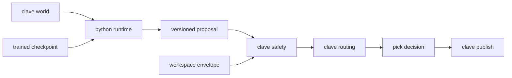

# Design Document

## Overview

This closes the loop CLAVE owns: a frame leaves the simulator, inference
proposes a pick, a Rust safety layer accepts or overrides it, and the decision
is published.

Its first job is a decision v0.3.0 deferred and nobody has made since: how Rust
consumes a model trained in Python.

### The inference boundary

**Python runs inference. Rust never loads a model.** The two communicate across
a process boundary carrying a versioned proposal.

Three alternatives were considered and rejected:

| Option | Why not |
| --- | --- |
| Export to ONNX, run it in Rust through `ort` | Adds a large native dependency to the one component the gate cannot do without, and an export step that can silently diverge from the trained model |
| TorchScript through `tch-rs` | Requires linking libtorch into the safety crate, which is the crate that most needs to stay small and auditable |
| Reimplement the models in a pure Rust framework | Two implementations of one architecture, drifting |

A process boundary costs latency, which is measurable and is measured here. It
buys a safety layer with no machine learning dependency at all, which is exactly
the property CLAVE's constitution claims for it: the crate that can override the
model shares no code with the model.

This is recorded as `D-05` in `docs/decisions.md`, because the standards still
say the runtime is chosen at the learning-platform step and it was not.

### Goals

- Settle the inference boundary in the open, with the rejected options named.
- A safety layer that can override the model on geometry the model cannot see.
- One command that runs the loop end to end.
- Frame-to-decision latency measured at p99 against the per-object budget.

### Non-Goals

- Handing the decision to FRET or ROS 2. v0.10.0.
- Moving the manipulator in response to a decision.
- Any claim that a decision is correct. The models saw 240 frames of primitives.

## Boundary Commitments

### This Spec Owns

- `crates/clave-safety`: the workspace envelope and its checks.
- `src/clave/runtime/`: the Python side that drives the world and proposes.
- The proposal wire format and its documentation.
- `configs/runtime/sitl.yml`.

### Out of Boundary

- **FRET and ROS 2.** v0.10.0.
- **Arm motion in response to a decision.** The runtime publishes; nothing acts.
- **The decision contract, the routing resolver and the publisher.** Already
  merged; consumed, not redesigned.
- **Training and metrics.**

### Allowed Dependencies

| Dependency | Direction | Criticality | Note |
|---|---|---|---|
| `clave-decision` | Inbound | P0 | The published contract and its codec |
| `clave-routing` | Inbound | P0 | Class and confidence to channel or reject |
| `clave-publish` | Inbound | P0 | The sink and its counters |
| `clave.world`, `clave.candidates` | Inbound | P0 | Frames, geometry, trained models |
| `serde_json` | External | P1 | The proposal boundary only, never the published contract |

### Revalidation Triggers

- v0.10.0 introduces ROS 2, which may replace this boundary's transport.
- The world's belt or reach geometry changes, invalidating the envelope.
- An accelerator appears, invalidating every latency figure.

## Architecture



The arrow from proposal to safety is the only place the two languages meet, and
nothing machine-learned crosses it.

### Technology Stack

| Layer | Tool | Role |
|---|---|---|
| Proposal wire | JSON, one object per datagram | Readable at the boundary a human debugs |
| Published wire | CBOR, unchanged | The cross-project contract, already specified |
| Transport | Unix datagram | Record boundaries from the kernel, as `D-02` already argued |

JSON for the proposal and CBOR for the decision is deliberate and not an
oversight. The proposal is internal, crossed at most tens of times a second, and
is the thing an engineer reads while debugging. The decision is the published
contract another project compiles against. Readability wins on one side and
stability on the other, and Python gains no new dependency.

## File Structure Plan

```
configs/runtime/sitl.yml
crates/clave-safety/Cargo.toml
crates/clave-safety/contract/proposal.md
crates/clave-safety/src/lib.rs
crates/clave-safety/src/envelope.rs
crates/clave-safety/src/error.rs
crates/clave-safety/src/proposal.rs
crates/clave-safety/src/verdict.rs
crates/clave-safety/tests/safety_test.rs
crates/clave-sitl/Cargo.toml
crates/clave-sitl/src/lib.rs
crates/clave-sitl/src/config.rs
crates/clave-sitl/src/error.rs
crates/clave-sitl/src/serve.rs
crates/clave-sitl/src/service.rs
crates/clave-sitl/src/main.rs
crates/clave-sitl/tests/loop_test.rs
src/clave/runtime/__init__.py
src/clave/runtime/proposal.py
src/clave/runtime/bridge.py
src/clave/runtime/inference.py
src/clave/runtime/loop.py
tests/runtime/proposal_test.py
tests/runtime/bridge_test.py
tests/runtime/loop_test.py
docs/research/sitl-runtime.md
```

| File | Status | Responsibility |
|---|---|---|
| `envelope.rs` | New | The workspace envelope, read from configuration |
| `proposal.rs` | New | The versioned proposal and its decoding |
| `verdict.rs` | New | Accepted or overridden, with the failed check named |
| `contract/proposal.md` | New | The boundary a producer implements against |
| `clave-sitl` | New | The process owning the sockets, the publisher and the counters |
| `proposal.py` | New | Building and encoding a proposal |
| `bridge.py` | New | The sockets, the child runtime, and one round trip |
| `inference.py` | New | What proposes a pick, trained or scripted |
| `loop.py` | New | Stepping the world, inferring, proposing, timing |
| `cli.py` | Modified | `clave run-sitl`, the one command that runs it |
| `docs/decisions.md` | Modified | `D-05`, the inference boundary |

`clave-sitl` is a separate crate rather than a binary target inside
`clave-safety`, so the crate that can override a model depends on nothing but
the contract and the routing policy. The socket loop, the publisher and the
counters live one level up, where a dependency costs nothing that matters.

## Components and Interfaces

| Component | Intent | Requirements |
|---|---|---|
| Proposal | A versioned boundary | 1.1, 1.2, 1.3, 1.4, 1.5 |
| Envelope | Geometry the model cannot see | 2.5 |
| Safety checks | Override rather than publish | 2.1, 2.2, 2.3, 2.4, 2.6 |
| Routing | Low confidence to reject | 2.7 |
| Loop | Run it end to end | 3.1, 3.2, 3.3, 3.4, 3.5 |
| Timing | p99 against the budget | 4.1, 4.2, 4.3, 4.4 |

### Proposal

Carries a version, an object id, a material class, a confidence, and a pick
point. Decoding refuses an unrecognized version rather than interpreting it,
satisfying 1.3, and a malformed payload is reported and skipped rather than
fatal, satisfying 1.4.

Nothing in the Rust side links a machine learning library, satisfying 1.2, which
is checkable by reading `clave-safety`'s manifest.

### Envelope and checks

The envelope carries the arm base, the reachable radius, the belt surface height
and the belt extent, all from configuration, satisfying 2.5.

Three checks, each producing a named failure: the point is within the reachable
radius of the arm base; the point is at or above the belt surface; the point is
inside the belt's extent. Every proposal reaches exactly one verdict, satisfying
2.6, because a proposal that satisfies every check is accepted and any other is
overridden with the first failing check named.

Confidence below the configured floor routes to the reject channel through the
existing resolver rather than being overridden, satisfying 2.7. That is a
routing decision rather than a safety failure, and conflating the two would make
the override count meaningless.

## Data Models

- **Proposal**: version, object id, material class, confidence, pick point.
- **Envelope**: arm base, reach radius, belt surface height, belt half extents.
- **Verdict**: accepted with a decision, or overridden with a named check.
- **RunCounters**: proposals, accepted, overridden by check, rejected on
  confidence.

**Invariants:**

1. Every proposal yields exactly one verdict.
2. An accepted proposal always produces a publishable decision.
3. An overridden proposal names the check that failed.

## Error Handling

| Condition | Response |
|---|---|
| Unrecognized proposal version | Refuse, per 1.3 |
| Malformed proposal | Report and continue, per 1.4 |
| Point outside reach, below belt, or off belt | Override with the check named, per 2.1 to 2.4 |
| Confidence below floor | Route to reject, per 2.7 |
| No reachable object | Publish nothing, per 3.3 |

## Testing Strategy

| Test | Proves |
|---|---|
| A proposal round-trips through the boundary | 1.1 |
| An unknown version is refused | 1.3 |
| A malformed payload is reported, not fatal | 1.4 |
| A point beyond reach is overridden, naming the check | 2.1, 2.4 |
| A point below the belt is overridden | 2.2 |
| A point off the belt is overridden | 2.3 |
| An in-envelope point is accepted | 2.6 |
| Every proposal in a swept grid gets exactly one verdict | 2.6 |
| Low confidence routes to reject, not override | 2.7 |
| The loop publishes nothing when nothing is reachable | 3.3 |
| The run reports accepted, overridden and rejected counts | 3.4 |
| Latency is reported at p99 | 4.2 |

`clave-safety` carries the hardened lint tier, since it is the crate whose
arithmetic decides whether an effector moves.

## Requirements Traceability

| Requirement | Component | Contract |
|---|---|---|
| 1.1 | Proposal | Versioned wire format |
| 1.2 | Proposal | No ML dependency in the manifest |
| 1.3 | Proposal | Unknown version refused |
| 1.4 | Proposal | Malformed reported, not fatal |
| 1.5 | Proposal | Documented format |
| 2.1 | Safety checks | Reach check |
| 2.2 | Safety checks | Belt surface check |
| 2.3 | Safety checks | Belt extent check |
| 2.4 | Verdict | Failed check named |
| 2.5 | Envelope | From configuration |
| 2.6 | Safety checks | Exactly one verdict |
| 2.7 | Routing | Confidence floor to reject |
| 3.1 | Loop | Decision per reachable frame |
| 3.2 | Loop | Trained checkpoint loaded |
| 3.3 | Loop | Nothing published when nothing reachable |
| 3.4 | Loop | Counters reported |
| 3.5 | Loop | Dataset size stated |
| 4.1 | Timing | Frame to decision measured |
| 4.2 | Timing | p99 reported |
| 4.3 | Timing | Against the per-object budget |
| 4.4 | Timing | Hardware recorded |

## Open Questions and Risks

- **The models decide badly.** They saw 240 frames of parametric primitives. The
  loop proves the mechanism and nothing about the decisions.
- **The process boundary costs latency** that an in-process design would not.
  Measuring it is the point; if it dominates the budget, the boundary is the
  thing to revisit rather than the models.
- **The envelope is a sphere and a box.** A real workspace is neither, so this
  over-permits near the edges of reach and is an upper bound on safety rather
  than a guarantee.
