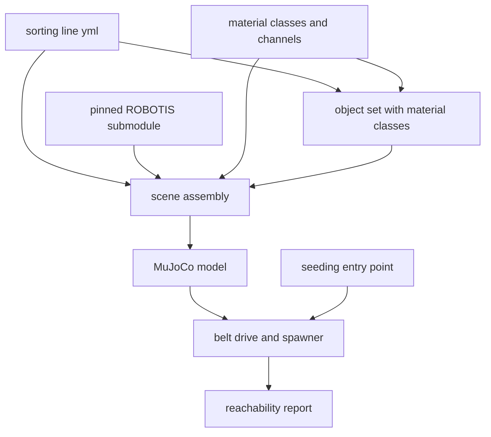

# Design Document

## Overview

This design delivers the simulated sorting line: a conveyor carrying
class-tagged objects past a ROBOTIS OpenMANIPULATOR-X, with one bin per channel.

The scene is assembled programmatically rather than written as a static MJCF
file. Bin count follows the taxonomy, object placement follows a seed, and belt
geometry follows configuration, none of which a fixed XML can express. The
manipulator is attached from a pinned submodule, which is FRET's convention and
keeps CLAVE from vendoring meshes.

### Goals

- A scene that steps, with objects that ride the belt into the arm's workspace.
- Every object carrying a taxonomy material class, so rollouts are labeled by
  construction.
- Every tunable in configuration with a randomization range.
- A stated per-object time budget, which is what turns v0.4.0's 391.7 ms
  detector latency into a pass or a fail.

### Non-Goals

- Training, policies, perception, reward functions, rollout recording.
- Photorealism. Objects are parametric primitives, and the report says what that
  costs.
- Any modification to FRET.

## Boundary Commitments

### This Spec Owns

- `clave.world`: configuration, object set, scene assembly, belt drive,
  reachability.
- `configs/world/sorting_line.yml`.
- The `world-probe` command.
- The submodule pin for the ROBOTIS menagerie.

### Out of Boundary

- **Rollout recording and dataset writing.** v0.6.0.
- **Reward shaping and any policy.** v0.7.0.
- **Scanned object meshes.** Recorded as an open question; primitives here.
- **The Rust contract and workspace.** Landing separately and independently.

### Allowed Dependencies

| Dependency | Direction | Criticality | Note |
|---|---|---|---|
| `docs/waste-taxonomy.md` | Inbound | P0 | Material classes and channels |
| `third_party/robotis_mujoco_menagerie` | External | P0 | Pinned submodule carrying the manipulator |
| `mujoco` | External | P0 | Physics, already a CPU-friendly workload |
| `clave.experiment.seeding` | Inbound | P0 | The single seeding entry point |

### Revalidation Triggers

- The taxonomy changes its class or channel count, changing the bin layout.
- The menagerie pin moves, changing the manipulator's geometry or joint limits.
- A belt speed or reach change invalidates the stated time budget, and with it
  every latency verdict that depends on it.

## Architecture

### Architecture Pattern and Boundary Map

Configuration drives assembly; assembly produces a model; the belt drive and the
spawner act on it each step.



### Technology Stack

| Layer | Tool | Role |
|---|---|---|
| Physics | `mujoco` 3.13 | Stepping, contacts, the model |
| Assembly | `mujoco.MjSpec` | Programmatic scene construction and attachment |
| Configuration | YAML through `pyyaml` | Every tunable, matching FRET's convention |
| Randomness | `clave.experiment.seeding` | No second source |

YAML here rather than the TOML the manifest uses, deliberately. A manifest is
append-mostly and machine-verified; a world configuration is edited constantly
by a human tuning belt speed and spawn rate, which is FRET's case for YAML and
applies unchanged.

## File Structure Plan

```
configs/world/sorting_line.yml
src/clave/world/__init__.py
src/clave/world/config.py
src/clave/world/objects.py
src/clave/world/scene.py
src/clave/world/belt.py
tests/world/config_test.py
tests/world/objects_test.py
tests/world/scene_test.py
tests/world/belt_test.py
```

| File | Status | Responsibility |
|---|---|---|
| `config.py` | New | Load and validate configuration, resolve ranges under a seed |
| `objects.py` | New | The object set, each entry carrying a material class |
| `scene.py` | New | Assemble belt, bins and manipulator into one model |
| `belt.py` | New | Carry objects, spawn them, report reachability |
| `configs/world/sorting_line.yml` | New | Every tunable |
| `src/clave/cli.py` | Modified | Gains `world-probe` |
| `.gitmodules` | Modified | The menagerie pin |

## Components and Interfaces

| Component | Intent | Requirements |
|---|---|---|
| Configuration | Every tunable outside code | 4.1, 4.2, 4.3 |
| Object set | Labeled by construction | 2.1, 2.2, 2.4 |
| Scene assembly | A model that steps | 1.1, 1.2, 1.3, 1.4 |
| Spawner | Seeded, reproducible placement | 2.3, 3.4, 4.4, 4.5 |
| Belt drive | Objects move at a stated speed | 3.1, 3.3 |
| Reachability | Latency becomes a verdict | 3.2, 5.1, 5.2, 5.3 |

### Configuration

Loading fails on a missing required key naming it, satisfying 4.2. Nothing
carries a default in Python or in the scene description, satisfying 4.1.

A randomizable quantity is a two-element range rather than a scalar, satisfying
4.3. Resolving a range draws through the platform's seeding entry point, so one
seed gives one world, satisfying 4.4 and 4.5.

### Object set

Each entry declares a name, a material class identifier, a primitive shape, a
size range, and a density. A class identifier outside the taxonomy fails at load
naming the object, satisfying 2.4.

Objects are parametric primitives sized from real counterparts: a drink bottle
is a slender cylinder, a food can a squat one, a carton and a box are boxes of
different proportions. This is a deliberate limitation. It gives correct mass,
footprint and contact behavior for belt dynamics and grasp width, and it gives
nothing at all for appearance, so a perception model trained on these frames
alone would learn shape and not material.

### Belt drive

MuJoCo has no conveyor primitive. Objects are free bodies whose horizontal
velocity is driven to the belt speed while they rest on the belt, leaving
vertical motion, rotation and contact to physics. This is a driven constraint
rather than a friction model, and it is the honest description of what the
simulation does.

An object that leaves the reachable window is left alone and continues to the
end of the belt, satisfying 3.3. Nothing is removed or stopped, because a real
line does not pause.

### Reachability

The manipulator's reachable radius is derived from its link geometry, and the
belt segment inside that radius is the reachable window. Dividing the window by
the belt speed gives the per-object time budget, satisfying 3.2, 5.1 and 5.3.

That budget is the number v0.4.0 lacked. A detector at 391.7 ms is a pass if the
budget is comfortably larger and a fail if it is not, and this is where that
becomes decidable.

## Data Models

- **WorldConfig**: belt geometry and speed range, spawn rate range, arm
  placement, bin layout, object set, camera, physics timestep.
- **ObjectSpec**: name, material class id, shape, size range, density range.
- **SpawnedObject**: identity, material class, spawn position, body name.
- **ReachReport**: reachable radius, window extent, belt speed, time budget.

**Invariants:**

1. Every `ObjectSpec` material class exists in the taxonomy.
2. Every randomizable configuration value is a two-element range with the lower
   bound not greater than the upper.
3. One bin exists per distinct channel across the object set.

## Error Handling

| Condition | Response |
|---|---|
| Missing configuration key | Fail at load naming the key, per 4.2 |
| Material class outside the taxonomy | Fail at load naming the object, per 2.4 |
| Inverted range | Fail at load naming the key |
| Submodule not checked out | Fail naming the submodule and the command that fixes it |
| Physics instability while stepping | Surface it rather than continuing, per 1.3 |

## Testing Strategy

| Test | Proves |
|---|---|
| A complete configuration loads | 4.1 |
| A missing key fails naming it | 4.2 |
| An inverted range fails naming it | 4.3 |
| Every object's class is in the taxonomy | 2.1, 2.4 |
| The object set covers at least six classes | 2.2 |
| The model builds and has a bin per channel | 1.1 |
| The model steps without instability | 1.3 |
| One seed twice gives identical placements | 4.4 |
| Two seeds give different placements | 4.5 |
| An object on the belt gains belt speed | 3.1 |
| An unpicked object is not removed | 3.3 |
| The reach report states radius, window and budget | 5.1, 5.3 |
| A travelling object enters the window | 5.2 |

Tests needing MuJoCo skip when it is absent, matching how the candidate tests
treat their optional libraries.

## Requirements Traceability

| Requirement | Component | Contract |
|---|---|---|
| 1.1 | Scene assembly | Belt, manipulator, bin per channel |
| 1.2 | Scene assembly | Attached from the submodule |
| 1.3 | Scene assembly | Steps without instability |
| 1.4 | Scene assembly | Exposed timestep |
| 2.1 | Object set | Class id per object |
| 2.2 | Object set | Six classes minimum |
| 2.3 | Spawner | Identity and class recorded |
| 2.4 | Object set | Unknown class rejected by name |
| 3.1 | Belt drive | Configured speed |
| 3.2 | Reachability | Time budget |
| 3.3 | Belt drive | Unpicked object continues |
| 3.4 | Spawner | Configured rate |
| 4.1 | Configuration | No embedded defaults |
| 4.2 | Configuration | Missing key named |
| 4.3 | Configuration | Ranges not scalars |
| 4.4 | Spawner | One seed, one world |
| 4.5 | Spawner | Two seeds differ |
| 5.1 | Reachability | Radius and window |
| 5.2 | Reachability | Entry reported |
| 5.3 | Reachability | Budget reported |

## Open Questions and Risks

- **Objects are primitives, not scanned meshes.** Belt dynamics and grasp width
  are represented; appearance is not. A perception model trained only on these
  frames would learn shape. Integrating a scanned object set is the obvious next
  refinement and is deferred rather than done.
- **The belt is a driven constraint, not a friction model.** Objects do not slip
  on the belt, which removes a disturbance a real line has and domain
  randomization would otherwise exercise.
- **The reachable radius is derived from link geometry, not from a solved
  workspace.** It is an upper bound: some poses inside the radius are not
  achievable given joint limits.
