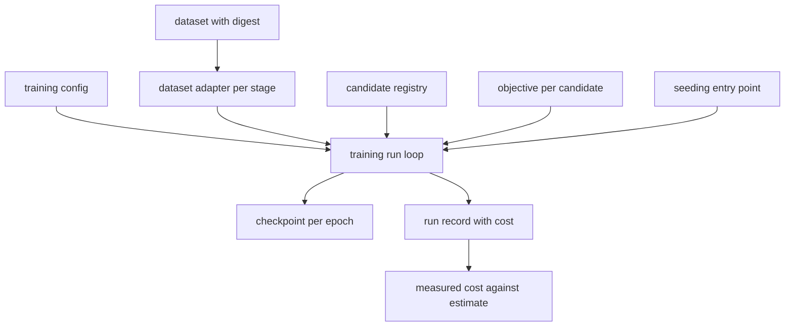

# Design Document

## Overview

This design delivers the application that trains a shortlisted candidate from a
configuration file, measures what it cost, and survives interruption.

Its scope is set by two constraints it did not choose. The hardware is a mobile
CPU inside 7 GiB with no accelerator, so cost is the number worth measuring. And
the world's arm is inert, since nothing writes `data.ctrl`, so the only pick
policy signal available is demonstrations from the scripted expert. That decides
which candidates can be trained at all, and the report names the rest.

The dataset is 240 frames. No accuracy claim is possible from it and none is
made. What is possible is a measurement of per-epoch wall-clock, which is the
number v0.1.2 estimated and could not check.

### Goals

- One command trains any candidate from configuration.
- Runs resume from a checkpoint and carry seed, configuration and dataset
  digests.
- Measured per-epoch cost per architecture, beside the estimate it replaces.
- Every untrained candidate named with the missing signal rather than blamed.

### Non-Goals

- Accuracy, precision, recall, or any claim that a candidate works.
- Arm actuation and the reward loop. v0.9.0.
- Metrics and gates. v0.8.0.

## Boundary Commitments

### This Spec Owns

- `clave.training`: configuration, dataset adapters, objectives, the run loop,
  checkpoints.
- `configs/training/`.
- The `train` command.

### Out of Boundary

- **Arm actuation and reward.** The absence is reported here and filled at
  v0.9.0.
- **Evaluation metrics.** v0.8.0 owns scoring; this step reports loss and cost.
- **The candidate registry.** v0.4.0 owns it and it is not reopened.
- **Dataset production.** v0.6.1 owns it; this step reads and verifies.

### Allowed Dependencies

| Dependency | Direction | Criticality | Note |
|---|---|---|---|
| `clave.candidates` | Inbound | P0 | Supplies architectures behind one interface |
| `clave.data` | Inbound | P0 | Supplies datasets, digests and the expert |
| `clave.experiment` | Inbound | P0 | Seeding and run records, reused |
| `clave.taxonomy` | Inbound | P0 | Class count for output heads |
| `torch` | External | P0 | Optional extra; imported lazily as elsewhere |

### Revalidation Triggers

- An accelerator appears, invalidating every cost measurement here.
- v0.9.0 actuates the arm, which makes reward-driven candidates trainable and
  changes which candidates this step could cover.
- The dataset grows enough for accuracy to mean something, at which point this
  step's refusal to report it stops applying.

## Architecture

### Architecture Pattern and Boundary Map



An objective is chosen per candidate rather than per stage, because a detector
and a classifier both perceive and are trained by entirely different losses.

### Technology Stack

| Layer | Tool | Role |
|---|---|---|
| Framework | PyTorch 2.14 CPU | Selected at v0.1.2; imported lazily |
| Architectures | `clave.candidates` | Loaded through the existing interface |
| Datasets | `clave.data` | Read with digest verification |
| Records | JSON | Readable without importing project code |

## File Structure Plan

```
configs/training/perception.yml
configs/training/policy.yml
src/clave/training/__init__.py
src/clave/training/config.py
src/clave/training/adapters.py
src/clave/training/objectives.py
src/clave/training/runner.py
tests/training/config_test.py
tests/training/adapters_test.py
tests/training/runner_test.py
```

| File | Status | Responsibility |
|---|---|---|
| `config.py` | New | Hyperparameters, all from file |
| `adapters.py` | New | Dataset to tensors, per training stage |
| `objectives.py` | New | Loss per candidate |
| `runner.py` | New | Loop, checkpoints, resumption, cost |
| `src/clave/cli.py` | Modified | Gains `train` |

## Components and Interfaces

| Component | Intent | Requirements |
|---|---|---|
| Configuration | No hyperparameter in code | 1.2 |
| Adapters | Correct data per stage | 1.3, 1.4, 1.5 |
| Objectives | Right loss per candidate | 1.1 |
| Runner | Train, checkpoint, resume, measure | 1.6, 2.1, 2.2, 2.3, 2.4, 2.5, 3.1, 3.2 |
| Report | Cost beside estimate, gaps named | 3.3, 3.4, 4.1, 4.2, 4.3, 5.1, 5.2, 5.3, 5.4 |

### Adapters

The perception adapter reads frames and labels from the training split only,
satisfying 1.4. For a detector it uses visible labels alone, satisfying 1.5,
because a label whose object is outside the frame has no pixels to regress
toward. For a classifier it produces a multi-label presence target over the
eleven classes, which is the well-posed task given frames containing several
objects.

The policy adapter replays the scripted expert over the training split and pairs
each observation with the decision the expert took, which is the only pick
signal the simulation produces.

### Objectives

| Candidate | Objective | Why |
|---|---|---|
| `resnet50-baseline` | Multi-label binary cross entropy | Several objects per frame, so presence rather than a single class |
| `faster-rcnn-mobilenetv3` | The detector's own composite loss | torchvision returns it in training mode |
| `behavior-cloning-baseline` | Mean squared error on pick position | The expert's decision is the target |
| `act` | Mean squared error on the action chunk | Same signal, chunked |

### Runner

Seeds through the existing entry point, verifies the dataset digest before
reading, writes a checkpoint each epoch, and resumes from the recorded epoch
when one exists. Records seed, configuration digest, dataset digest,
environment, per-epoch loss and per-epoch wall-clock, satisfying 2.1 through
2.5 and 3.1 and 3.2. A candidate whose library is absent is reported unavailable
rather than raising, satisfying 1.6, reusing the load result the registry
already returns.

## Data Models

- **TrainingConfig**: candidate name, epochs, batch size, learning rate, dataset
  path, checkpoint directory, seed.
- **EpochRecord**: index, loss, wall-clock seconds.
- **TrainingRun**: candidate, seed, configuration digest, dataset digest,
  environment, epochs, completed flag.

**Invariants:**

1. A run never reads the validation or test split.
2. A detector run sees only visible labels.
3. A run record's dataset digest matches the dataset it read.

## Error Handling

| Condition | Response |
|---|---|
| Candidate library absent | Report unavailable, per 1.6 |
| Dataset digest mismatch | Refuse before training, per 1.3 |
| Checkpoint from a different candidate | Refuse rather than resume into it |
| No visible labels in a detection batch | Skip the batch rather than emit an empty target |

## Testing Strategy

| Test | Proves |
|---|---|
| A config without a key fails naming it | 1.2 |
| The adapter reads only the training split | 1.4 |
| The detection adapter drops invisible labels | 1.5 |
| A digest mismatch refuses before training | 1.3 |
| A missing library reports unavailable | 1.6 |
| A checkpoint is written per epoch | 2.1 |
| A restart resumes at the recorded epoch | 2.2 |
| A run record carries seed, digests, environment | 2.3 |
| Epoch records reload from JSON | 2.4 |
| One seed twice gives the same first-epoch loss | 2.5 |
| Epoch records carry wall-clock | 3.1, 3.2 |

Tests needing torch skip when it is absent, as the candidate tests do.

## Requirements Traceability

| Requirement | Component | Contract |
|---|---|---|
| 1.1 | Objectives, Runner | Candidate named in configuration |
| 1.2 | Configuration | No embedded default |
| 1.3 | Runner | Digest verified before reading |
| 1.4 | Adapters | Training split only |
| 1.5 | Adapters | Visible labels only for detection |
| 1.6 | Runner | Unavailable reported |
| 2.1 | Runner | Checkpoint per epoch |
| 2.2 | Runner | Resume from recorded epoch |
| 2.3 | Runner | Seed, digests, environment |
| 2.4 | Runner | JSON epoch records |
| 2.5 | Runner | Reproducible first-epoch loss |
| 3.1 | Runner | Per-epoch wall-clock |
| 3.2 | Runner | Hardware and threads |
| 3.3 | Report | Measurement beside estimate |
| 3.4 | Report | Contradicted verdicts named |
| 4.1 | Report | Untrained candidates named |
| 4.2 | Report | Missing signal named |
| 4.3 | Report | Unmet target stated |
| 5.1 | Report | Dataset size stated |
| 5.2 | Report | No accuracy presented as evidence |
| 5.3 | Report | Convergence or early stop stated |
| 5.4 | Report | No real imagery evaluated |

## Open Questions and Risks

- **The dataset is 240 frames.** Every loss curve here describes optimization on
  a toy, and the report must not let that be mistaken for evidence.
- **The arm is inert**, so reward-driven candidates cannot be trained at all.
  That is the single largest gap between this step and a working system, and it
  is v0.9.0's to close.
- **Cost measurements are CPU-only** and become void if an accelerator appears.
