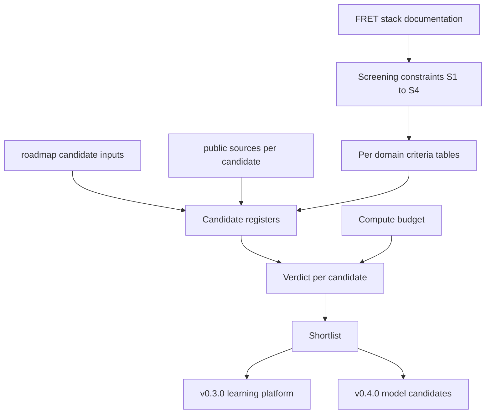

# Design Document

## Overview

This design specifies the structure, the screening method, and the delivery
form of CLAVE's v0.1.0 bibliographic review. It does not conduct the review.
What it fixes is the shape the review must take so that its verdicts are
re-examinable later and so that a reader can tell a deliberate rejection from an
omission.

The design adopts a pattern the family already runs. FRET's
`docs/vision/algorithm-selection.md` screens detector options through a weighted
criteria table with stable criterion ids and records a status per candidate.
CLAVE reuses that skeleton, extended from one decision to three survey domains,
so a reader who has seen one selection document in this family can read the
other without relearning the form.

One deliverable results: a single Markdown document under `docs/research/`.
There is no executable component. A structural contract makes the document
mechanically checkable later, and enforcement is deferred to the step that owns
Python tooling.

### Goals

- Fix a document structure in which every surveyed option carries a license, a
  maintenance signal, and a verdict, so that a later reader can audit the
  decision rather than trust it.
- Fix a screening method stated once and applied uniformly, with stable
  criterion ids, so that changing a constraint identifies the rejections worth
  revisiting.
- Fix a shortlist format that `learning-platform` and `model-candidates` consume
  directly.
- Fix a structural contract precise enough that a checker written at v0.3.0
  needs no change to the delivered document.

### Non-Goals

- Conducting the survey. The content of the review is produced by the tasks this
  spec generates, not decided here.
- Choosing CLAVE's architecture, corpus, or framework. This design fixes how the
  shortlist is presented; `model-candidates` and `learning-platform` choose from
  it.
- Standing up Python tooling, a test runner, or a coverage gate.
- Fetching, mirroring, or redistributing any corpus.

## Boundary Commitments

### This Spec Owns

- The review document at `docs/research/training-infrastructure-review.md`, its
  section order, and its contents.
- The screening constraint set, the per-domain criteria tables, and the stable
  criterion id scheme.
- The candidate table schemas, meaning exact column headers per survey domain
  and which cells may never be empty.
- The closed verdict vocabulary and its meaning.
- The compute budget section, including its unresolved state and how a verdict
  that depends on an unresolved budget is marked.
- The shortlist section and its grouping by consuming roadmap step.

### Out of Boundary

- **Simulated object mesh sources.** The roadmap lists them among this step's
  candidate inputs, but no approved requirement covers them and they do not fit
  the corpus schema. They are surveyed at v0.5.0 `sorting-world`, next to the
  scene that consumes them and after v0.2.0 settles the material taxonomy that
  decides whether a mesh set is usable. This divergence from the roadmap is an
  open question below rather than a unilateral amendment.
- **Mechanical enforcement of the table schemas.** Belongs to v0.3.0
  `learning-platform`, which stands up Python tooling.
- **The material taxonomy and sorting doctrine.** Belongs to v0.2.0
  `waste-taxonomy`. The review names corpus label sets but does not map them.
- **Any change to FRET, ARCO, or BOSSA.** The review takes FRET's stack as given
  and records rejections against it.
- **The hardware inventory itself.** A maintainer input, not an agent finding.

### Allowed Dependencies

| Dependency | Direction | Criticality | Note |
|---|---|---|---|
| `.kiro/steering/roadmap.md` | Inbound | P0 | Supplies the screening constraints and the candidate starting points |
| `standards/guidelines/agents/writing.md` | Inbound | P0 | Governs prose, typography, and the dating rule for external claims |
| FRET repository documentation | External | P1 | Source of the manipulator, expert, and simulator facts the constraints rest on |
| Public sources for each candidate | External | P1 | Cited, never vendored |
| `scripts/validate.sh` | None | P2 | Unchanged by this spec |

The review document depends on nothing executable, and nothing executable
depends on it. That is the whole dependency graph for this spec.

### Revalidation Triggers

- The maintainer supplies the hardware inventory, which resolves the compute
  budget and turns any provisional verdict final.
- v0.3.0 `learning-platform` stands up Python tooling and inherits the
  obligation to enforce the table schemas fixed here.
- FRET changes its manipulators, its scripted expert, or its simulator, which
  invalidates every rejection recorded against constraint `S2` or `S3`.
- The roadmap's v0.1.0 candidate table is amended over mesh sources, which
  either closes or confirms the divergence recorded above.
- A shortlisted corpus or project changes its license, which invalidates the
  verdict recorded against constraint `S1`.

## Architecture

### Existing Architecture Analysis

CLAVE holds no application code, so there is no local architecture to extend.
The relevant precedent is in the sibling repositories. FRET's
`docs/vision/algorithm-selection.md` establishes the house form for a screening
decision: goal, selection status, weighted criteria table with stable ids,
candidate table with status, and an interface section stating what survives a
change of choice. FRET's `docs/vision/README.md` adds a locked-decisions table
that separates settled questions from open ones.

This design follows that form. It diverges in two places, both forced by the
subject. The criteria table is per survey domain rather than global, because a
corpus and a training framework cannot be scored on one rubric. And a verdict
carries the id of the constraint it failed, which FRET does not need because it
screens against one implicit context.

### Architecture Pattern and Boundary Map

The review is a single document composed of six sections in a fixed order. The
order is load-bearing: constraints precede verdicts so that no verdict can be
read before the rule it was reached under, and the shortlist precedes the
surveys so a consuming reader is not required to read the evidence first.



Key decisions not visible in the diagram: the compute budget feeds verdicts
rather than the shortlist directly, because an over-budget option is rejected at
the same stage as a license failure rather than filtered afterwards. And the
shortlist is grouped by consuming step, so neither consumer has to work out
which rows apply to it.

### Technology Stack

| Layer | Tool | Role |
|---|---|---|
| Document | Markdown, CommonMark tables | The single deliverable, committed to the repository |
| Prose rules | `standards/guidelines/agents/writing.md` | Typography, vocabulary, and the rule that a claim about an external project carries a date |
| Gate | `scripts/validate.sh`, unchanged | Submodule check only; no new step is added by this spec |

No new dependency is introduced, and no file outside `docs/research/` is
created or modified.

## File Structure Plan

### Directory Structure

```
docs/
  research/
    training-infrastructure-review.md
```

| File | Status | Responsibility |
|---|---|---|
| `docs/research/training-infrastructure-review.md` | New | The entire deliverable: constraints, criteria, candidate registers, compute budget, shortlist, and open questions |

Every component named in Components and Interfaces is a section of that single
file. The spec creates no other file, so component-to-file mapping is total and
one-to-one by construction.

### Modified Files

None. `scripts/validate.sh` is deliberately untouched, since enforcement is out
of boundary.

## Components and Interfaces

All components are sections of one document. The contract between them is
ordering and cross-reference by stable id, and the contract with later steps is
the shortlist.

| Component | Domain | Intent | Requirements |
|---|---|---|---|
| Screening constraints | Method | State the rules once, before any verdict | 5.1, 5.2, 5.3 |
| Criteria tables | Method | Score candidates per domain against stable ids | 3.3, 5.1 |
| Corpus register | Survey | Record every candidate corpus in one schema | 1.1, 1.2, 1.3, 1.4, 1.5 |
| Architecture register | Survey | Record every candidate architecture in one schema | 2.1, 2.2, 2.3, 2.4, 2.5 |
| Infrastructure register | Survey | Record every candidate infrastructure option | 3.1, 3.2, 3.3, 3.4 |
| Compute budget | Survey | State the hardware and the cost, or state that it is unresolved | 4.1, 4.2, 4.3, 4.4 |
| Shortlist | Decision | Name what advances, grouped by consuming step | 6.1, 6.2, 6.3, 6.4 |
| Open questions | Decision | Name what could not be determined | 6.4, 4.4 |
| Document conventions | Delivery | Location, citation, and dating rules | 7.1, 7.2, 7.3, 7.4, 7.5 |

### Method: Screening constraints

Four constraints, stated once before any candidate table, each with a stable id
so a verdict can name the one it failed.

| Id | Constraint |
|---|---|
| `S1` | The license permits CLAVE's intended use |
| `S2` | The option works with FRET's MuJoCo simulation and the ROBOTIS manipulators, without a different simulator or robot |
| `S3` | The training signal the option needs can be produced by FRET's scripted `PickPlaceFSM` expert |
| `S4` | Training fits the stated compute budget |

`S3` applies only to pick-policy architectures. A register row for a corpus or
an infrastructure option records `S3` as not applicable rather than leaving it
blank, so that blank always means omission.

**Verdict vocabulary**, closed. A verdict cell contains exactly one of:

| Verdict | Meaning |
|---|---|
| `Advance` | Passes every applicable constraint and appears in the shortlist |
| `Advance (provisional)` | Passes every applicable constraint except `S4`, which is unresolved |
| `Reject` | Fails at least one constraint; the failed constraint id is recorded |
| `Unavailable` | Cannot be retrieved from a working public source |
| `Baseline` | Advances as a deliberate simple comparator rather than on merit |

`Baseline` exists so that 2.5 is satisfiable without a simple comparator having
to argue for itself on the same terms as a sophisticated option.

### Method: Criteria tables

One weighted criteria table per survey domain, following FRET's form: an id, a
criterion, and a weight of High, Medium, or Low. Criterion ids are per domain
and prefixed, meaning `C-CORPUS-1`, `C-ARCH-1`, `C-INFRA-1`. Weights express
what the review cares about and make a close call arguable rather than asserted.

Criteria are distinct from constraints. A constraint is pass or fail and
produces a verdict. A criterion is comparative and orders the survivors.

### Survey: Corpus register

Exact header, in this order:

```
| Corpus | License | Size | Annotation type | Capture conditions | Difference from CLAVE scene | Constraint failed | Verdict | Source |
```

Cells that may never be empty: every one. `Constraint failed` holds a dash when
the verdict is not `Reject`. At least four rows, of which at least one records
capture conditions on an operating sorting line, which satisfies 1.1.

### Survey: Architecture register

Exact header, in this order:

```
| Architecture | Stage | License | Weights license | Last release | Training signal | Published result | Measured on | Constraint failed | Verdict | Source |
```

`Stage` is `Perception` or `Policy`. `Training signal` is required for the
policy stage and records `n/a` for perception, distinguishing demonstrations
from reward as 2.3 requires. `Published result` and `Measured on` together
satisfy 2.4, and `Source` carries the citation that attributes both.

The register must contain at least three rows with `Stage` of `Perception` and a
verdict of `Advance` or `Baseline`, and at least three with `Stage` of `Policy`
and the same, which satisfies 2.1. At least one `Baseline` per stage satisfies
2.5.

### Survey: Infrastructure register

Exact header, in this order:

```
| Option | Purpose | License | Runs on FRET MuJoCo unforked | Reproducibility requirements | Tradeoff against | Constraint failed | Verdict | Source |
```

`Runs on FRET MuJoCo unforked` is `Yes` or `No` and satisfies 3.2. `Tradeoff
against` names the competing option and states the tradeoff in one clause,
satisfying 3.3; it holds a dash when nothing competes. `Reproducibility
requirements` covers seed control and environment pinning, satisfying 3.4.

### Survey: Compute budget

Two states, and the section declares which one it is in on its first line.

- **Resolved.** States accelerator model, memory, and whether access is
  continuous or shared, satisfying 4.1. Every cost estimate is wall-clock time
  on that hardware with its governing assumption named, satisfying 4.2.
- **Unresolved.** States that the hardware inventory has not been supplied,
  satisfying 4.4. Every architecture that would otherwise advance carries the
  verdict `Advance (provisional)`, and no option may be rejected under `S4`
  while the budget is unresolved.

### Decision: Shortlist

Grouped by consuming step, satisfying 6.1:

- **Consumed by v0.3.0 `learning-platform`**: infrastructure options and the
  corpora whose storage the platform must accommodate.
- **Consumed by v0.4.0 `model-candidates`**: perception and policy
  architectures.

Each entry names the constraint-based reason it advanced, satisfying 6.2. If
either stage has fewer than three advancing architectures, the shortlist states
that the roadmap target is unmet and names what would have to change, satisfying
6.3.

### Decision: Open questions

A closing section naming what the review could not determine, satisfying 6.4. It
carries at minimum the compute budget when unresolved, and the mesh-source
divergence recorded under Out of Boundary.

### Delivery: Document conventions

- Published at `docs/research/training-infrastructure-review.md`, satisfying 7.1.
- Every fact about a third-party project, corpus, or result carries a citation
  in the row's `Source` cell or an inline link, satisfying 7.2.
- Every claim about an external project that is expected to change carries a
  date, satisfying 7.3. This matches the rule in `agents/writing.md` that a
  claim about something outside the project carries a date precisely because it
  will expire.
- No estimate, unmeasured number, or unreproduced result is presented as
  CLAVE's own. Published results appear only in the `Published result` column
  with `Measured on` and `Source` beside them, satisfying 7.4 and 7.5.

## Data Models

### Domain Model

Three record types, one per survey domain, sharing a common tail.

- **CorpusRecord**: identity, license, size, annotation type, capture
  conditions, scene difference, plus the common tail.
- **ArchitectureRecord**: identity, stage, license, weights license, last
  release date, training signal, published result, measurement task, plus the
  common tail.
- **InfrastructureRecord**: identity, purpose, license, FRET compatibility,
  reproducibility requirements, competing option and tradeoff, plus the common
  tail.

**Common tail**, present on every record: `Constraint failed`, `Verdict`,
`Source`.

**Invariants**, which are what a checker at v0.3.0 will enforce:

1. No cell is empty. Absence is written as `n/a` or a dash, never as blank.
2. `Verdict` is drawn from the closed vocabulary.
3. `Constraint failed` is populated exactly when `Verdict` is `Reject`, and
   names one of `S1` through `S4`.
4. No record carries `Reject` against `S4` while the compute budget is
   unresolved.
5. `Source` resolves to a retrievable public reference.

## Error Handling

The failure modes are content failures, caught by review.

| Condition | Response |
|---|---|
| A candidate cannot be retrieved from a public source | Record `Unavailable` rather than omitting it, per 1.5 |
| A license forbids CLAVE's use | Record `Reject` against `S1` and cite the clause, per 1.4 |
| Training cost exceeds the budget | Record `Reject` against `S4`, per 4.3 |
| The hardware inventory is missing | Declare the budget unresolved and mark affected verdicts provisional, per 4.4 |
| Fewer than three architectures advance for a stage | State the target is unmet and name what would change it, per 6.3 |
| A fact cannot be attributed | Move it to Open questions rather than asserting it, per 7.2 and 7.4 |

## Testing Strategy

Verification is document review. There is no code, so there is no unit suite,
and the coverage gate does not apply.

**Structural checks**, performed by a reviewer against this design and later by
a checker at v0.3.0:

1. Each register's header row matches the exact header declared above.
2. No cell in any register is empty.
3. Every `Verdict` is in the closed vocabulary.
4. `Constraint failed` is populated exactly when `Verdict` is `Reject`.
5. The corpus register has at least four rows and at least one with operating-line
   capture conditions.
6. Each stage has at least three architectures verdicted `Advance`, `Advance
   (provisional)`, or `Baseline`, and at least one `Baseline`.
7. The budget section declares resolved or unresolved on its first line.
8. No `Reject` against `S4` exists while the budget is unresolved.

**Content checks**, which only a reviewer can perform:

1. Every rejection names a constraint that actually explains it, rather than a
   constraint chosen to justify a preference formed first.
2. Every advancing entry's reason is stated in constraint terms rather than as
   praise, which is 6.2 and the point of 5.5.
3. Every dated claim is one that can expire, and every claim that can expire is
   dated.
4. The shortlist is actionable without reading the surveys.

## Requirements Traceability

| Requirement | Summary | Components | Contract |
|---|---|---|---|
| 1.1 | At least four corpora, one from an operating line | Corpus register | Row count and capture-conditions cell |
| 1.2 | License, size, annotation type, capture conditions | Corpus register | Header columns 2 to 5 |
| 1.3 | Difference from a conveyor scene | Corpus register | `Difference from CLAVE scene` |
| 1.4 | Reject on license, cite the clause | Corpus register, Screening constraints | Verdict `Reject`, `Constraint failed` = `S1` |
| 1.5 | Unretrievable corpus recorded as unavailable | Corpus register | Verdict `Unavailable` |
| 2.1 | Three per stage pass screening | Architecture register | Row count per `Stage` |
| 2.2 | License, last release, weights license | Architecture register | Header columns 3 to 5 |
| 2.3 | Training signal, demonstrations against reward | Architecture register | `Training signal` |
| 2.4 | Published result, its task, attributed | Architecture register | `Published result`, `Measured on`, `Source` |
| 2.5 | A simple baseline per stage | Architecture register, Verdict vocabulary | Verdict `Baseline` |
| 3.1 | Survey frameworks, execution, interfaces | Infrastructure register | `Purpose` |
| 3.2 | Runs against FRET's MuJoCo unforked | Infrastructure register | `Runs on FRET MuJoCo unforked` |
| 3.3 | Tradeoff stated, not presented as equivalent | Infrastructure register, Criteria tables | `Tradeoff against` |
| 3.4 | Seed control and environment pinning | Infrastructure register | `Reproducibility requirements` |
| 4.1 | Hardware named | Compute budget | Resolved state |
| 4.2 | Cost in wall-clock time with assumption | Compute budget | Resolved state |
| 4.3 | Reject over budget regardless of results | Compute budget, Screening constraints | `Constraint failed` = `S4` |
| 4.4 | Unresolved rather than assumed | Compute budget | Unresolved state |
| 5.1 | Constraints stated once, applied uniformly | Screening constraints | `S1` to `S4` before any register |
| 5.2 | FRET simulator and manipulators | Screening constraints | `S2` |
| 5.3 | Scripted expert supplies the signal | Screening constraints | `S3` |
| 5.4 | Rejection records the failed constraint | All registers | `Constraint failed` |
| 5.5 | No advancement on reputation | Verdict vocabulary, Shortlist | Reason stated in constraint terms |
| 6.1 | Shortlist grouped by consuming step | Shortlist | Two groups |
| 6.2 | Reason in constraint terms | Shortlist | Per-entry reason |
| 6.3 | Unmet target stated | Shortlist | Conditional statement |
| 6.4 | What could not be determined | Open questions | Section presence |
| 7.1 | Published under `docs/research/` | Document conventions | File path |
| 7.2 | Every external fact attributed | Document conventions, all registers | `Source` |
| 7.3 | Expiring claims dated | Document conventions | Inline date |
| 7.4 | No fabricated measurement | Document conventions | `Published result` with `Measured on` |
| 7.5 | Report only what sources report | Document conventions | No CLAVE-produced numbers |

## Open Questions and Risks

- **Mesh sources diverge from the roadmap.** The roadmap lists simulated object
  meshes among this step's candidate inputs; this design places them at v0.5.0.
  The maintainer either amends the roadmap entry or accepts the divergence. Work
  can proceed either way, because nothing in this spec depends on the answer.
- **The compute budget may stay unresolved.** If the hardware inventory does not
  arrive, the shortlist ships with provisional entries. That is the designed
  behavior, not a failure, but it means v0.4.0 inherits an unclosed question.
- **The floor of four corpora and three architectures per stage is a target, not
  a finding.** If screening leaves fewer, 6.3 requires the review to say so
  rather than lowering the bar to meet the number.
- **Enforcement gap until v0.3.0.** Between this step and `learning-platform`, a
  blank required cell is caught by a human or not at all. Accepted, because the
  review is one document reviewed once, and the structural contract keeps a gap
  visible rather than buried in prose.
