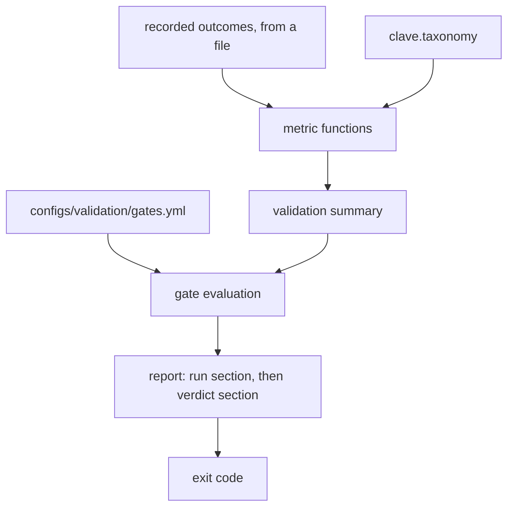

# Design Document

## Overview

The harness is a scorer, not a runner. It takes a list of records describing
what happened to each object presented to the system, computes the metrics the
taxonomy and the sorting world asked for, compares each one against a threshold
read from configuration, and emits a report whose first half says what was
scored and whose second half says what that means.

Keeping the scorer separate from whatever produces the records is the decision
the rest of the design follows from. A metric that needs a simulator to compute
cannot be unit tested, cannot be reproduced from a file six months later, and
cannot be reviewed without a GPU. Every metric here is a pure function over a
sequence of frozen records, so a reviewer checks a number by reading the records
and the function.

The gates are the other half of the value. A threshold that appears after the
run describes the run; a threshold committed to configuration before it is a
gate. Nothing in the Python carries a numeric threshold, so the only way to move
a gate is to edit a file that shows up in a diff.

### Goals

- One small record type, with the metric functions depending on its fields
  rather than on any file format.
- Per-class accuracy and a confusion matrix over the eleven taxonomy classes.
- Missed picks counted apart from misroutes, and rejects counted apart from
  both.
- Decision latency at p99 and cycle time, with the percentile method stated.
- The three confusions the taxonomy names, reported individually.
- Thresholds in configuration, and an unmet gate turning the run into a failure.

### Non-Goals

- Producing the records. v0.6.0 owns rollout capture and v0.7.0 owns training.
- Loading a checkpoint or running inference.
- Stepping MuJoCo.
- Reporting any accuracy figure as a measurement, because no candidate has been
  trained.

## Boundary Commitments

### This Spec Owns

- `clave.validation`: the record type, the metric functions, the named
  confusions, the gate thresholds and their evaluation, and the report.
- `configs/validation/gates.yml`.
- The `validate-run` command.
- `docs/validation-protocol.md`.

### Out of Boundary

- **The rollout format.** v0.6.0 owns it. See
  [The record type is a placeholder](#the-record-type-is-a-placeholder).
- **`clave.world`.** The harness never builds a scene. It reads the sorting
  world's published time budget as a number in a document, not as an import.
- **`clave.candidates`.** No model is loaded to compute a metric.
- **The taxonomy.** Class identifiers and the three named confusions come from
  `docs/waste-taxonomy.md` through `clave.taxonomy`, and are not redefined here.

### Allowed Dependencies

| Dependency | Direction | Criticality | Note |
|---|---|---|---|
| `clave.taxonomy` | Inbound | P0 | Supplies the eleven class identifiers and the default channel per class |
| `clave.errors` | Inbound | P0 | The package exception root every validation error descends from |
| `docs/waste-taxonomy.md` | Inbound | P0 | Names the three confusions and the missed-pick against misroute split |
| `docs/research/sorting-world.md` | Inbound | P1 | Supplies the 1.13 second per-object budget a cycle time gate is set against |
| `pyyaml` | External | P0 | Already a core dependency; reads the gate configuration |

### Revalidation Triggers

- v0.6.0 lands the rollout format, which supersedes the record type here.
- The taxonomy adds, retires, or renames a class, which resizes the confusion
  matrix and may add a named confusion.
- The sorting world changes its belt speed range, which moves the per-object
  time budget and therefore the cycle time gate.
- A trained candidate runs through the harness for the first time, at which
  point the thresholds get their first contact with a real distribution.

## Architecture

### Architecture Pattern and Boundary Map

Four layers, each a pure function of the one before it, with configuration
entering only at the gate layer.



Nothing flows backwards. A metric cannot read a threshold, which is what keeps a
metric from quietly becoming its own gate.

### The record type is a placeholder

`ObjectOutcome` is defined here because the harness needs something to be a pure
function of, and v0.6.0 has not landed. It is a placeholder, and the data
pipeline supersedes it.

The handover is designed to be cheap. Every metric function takes a sequence of
records and reads named fields; none of them opens a file, and none of them
knows that a JSON representation exists. When v0.6.0 publishes its rollout type,
the metric functions keep their signatures and one adapter converts a rollout
record into the fields below. The JSON reader in `outcomes.py` is the part that
gets deleted.

What must not happen is the reverse: the metrics growing a dependency on the
file layout, at which point the handover becomes a rewrite. The testing strategy
enforces this by constructing records in code for every metric test, so a metric
test that needed a file would stand out.

### Deciding what a record means

| Situation | Field state | Counted as |
|---|---|---|
| The object was grasped and placed in the channel its true class belongs in | `picked` true, `routed_channel` equal to the expected channel | Correct route, and a successful pick |
| The object was grasped and placed in the reject channel while its class has a material channel | `picked` true, `routed_channel` is the reject channel | Reject, and a successful pick |
| The object was grasped and placed in a different material channel | `picked` true, `routed_channel` is another channel | Misroute, and a successful pick |
| The object left the reachable window untouched | `picked` false, `routed_channel` absent | Missed pick, and no routing outcome at all |

A missed pick is a throughput loss and a misroute contaminates a bale, which is
the taxonomy's distinction and the reason the fourth row contributes nothing to
the routing counts. A reject sits between them: the material is not recovered,
but no bale is contaminated, so it earns its own count rather than being folded
into either neighbor.

Every record in a run describes an object that was presented to the system,
meaning it entered the arm's reachable window. An object that never entered the
window is outside the harness's boundary, because nothing could have been done
about it.

### The percentile method

Percentiles use the nearest-rank method on the sorted sample: the value at index
`ceil(fraction * count) - 1`, clamped into range. Nearest-rank returns an
observed sample rather than an interpolated one, so p99 is a latency the system
actually produced. It is deterministic, it needs no floating point beyond the
index computation, and stating it once removes the class of argument where two
tools disagree about p99 by a millisecond.

The count behind every percentile travels with it, because p99 over eleven
samples is the maximum wearing a percentile's name.

## File Structure Plan

```
src/clave/validation/__init__.py
src/clave/validation/outcomes.py
src/clave/validation/metrics.py
src/clave/validation/confusions.py
src/clave/validation/gates.py
src/clave/validation/report.py
tests/validation/__init__.py
tests/validation/outcomes_test.py
tests/validation/metrics_test.py
tests/validation/confusions_test.py
tests/validation/gates_test.py
tests/validation/report_test.py
configs/validation/gates.yml
docs/validation-protocol.md
```

| File | Status | Responsibility |
|---|---|---|
| `outcomes.py` | New | `ObjectOutcome`, `OutcomeSet`, validation against the taxonomy, and the placeholder JSON reader |
| `metrics.py` | New | Confusion matrix, per-class accuracy, routing counts, percentiles, timing summaries, and the split by seen against unseen |
| `confusions.py` | New | The three named confusions and the rate of each |
| `gates.py` | New | Threshold loading with no defaults, and gate evaluation |
| `report.py` | New | Assembly of the run section and the verdict section, and rendering |
| `configs/validation/gates.yml` | New | Every threshold, with the reason each was set where it was |
| `docs/validation-protocol.md` | New | The protocol, the gates, and what is not proven |
| `src/clave/cli.py` | Modified | Gains `validate-run` |

`pyproject.toml` is unchanged. The harness introduces no dependency the core
does not already carry.

## Components and Interfaces

| Component | Intent | Requirements |
|---|---|---|
| `ObjectOutcome`, `OutcomeSet` | One record per presented object, with provenance | 1.1, 1.3, 1.4, 1.5, 1.6 |
| Metric functions | Pure functions over records | 1.2, 2.1, 2.2, 2.3, 2.4, 2.5, 3.1, 3.2, 3.3, 3.4, 3.5, 3.6, 4.1, 4.2, 4.3, 4.4, 4.5 |
| Named confusions | The three the taxonomy names | 5.1, 5.2, 5.3, 5.4, 5.5 |
| Gate thresholds | Configuration, never a code default | 6.1, 6.2, 6.5, 6.6, 6.7 |
| Gate evaluation | An unmet gate is a failure | 6.3, 6.4 |
| Report and command | Run apart from verdict, one command | 7.1, 7.2, 7.3, 7.4, 7.5 |

### `outcomes.py`

`ObjectOutcome` is frozen and carries: the object identifier, the true class,
the predicted class or `None` when nothing was predicted, whether the object was
picked, the channel it was routed to or `None`, whether the instance was seen
during training, the decision latency in seconds, and the cycle time in seconds
or `None`.

`OutcomeSet` wraps a tuple of records with a `provenance` string. Construction
validates every class identifier against `clave.taxonomy` and raises
`OutcomeError` naming the offending value, which satisfies 1.3. It also refuses
a record whose `picked` flag and `routed_channel` disagree in either direction,
because a picked object landed somewhere and an unpicked one did not, and either
contradiction breaks the third invariant below. A negative duration is refused
for the same reason: it cannot be a time anything took.

`load_outcomes(path)` reads the placeholder JSON. The reader is the part
v0.6.0 deletes.

### `metrics.py`

- `ConfusionMatrix`: counts indexed by taxonomy order, plus a per-class count of
  records with no prediction, satisfying 2.1 and 2.3. `per_class_accuracy`
  returns `None` for a class with no support, satisfying 2.5.
- `RoutingCounts`: presented, picked, missed, correct routes, rejects,
  misroutes, and the rates derived from them. Satisfies 3.1 through 3.6. The
  expected channel comes from a `channel_map` argument, satisfying 3.3;
  `default_channel_map()` builds one from the taxonomy, and the committed gate
  configuration writes all eleven entries out so a deployment with a different
  number of bins edits a file rather than the package.
- `percentile(values, fraction)`: nearest rank, satisfying 4.3.
- `TimingSummary`: sample count, p50, p95, p99, mean, and maximum, or `None`
  throughout when the series is empty. Satisfies 4.1, 4.2, 4.4, and 4.5.
- `split_by_instance(outcomes)`: seen and unseen partitions, so accuracy can be
  computed on each, satisfying 2.4.

### `confusions.py`

Three `NamedConfusion` values, each carrying an identifier, a display name, the
class identifiers it spans, and the reason a color camera cannot make the
separation, satisfying 5.1 and 5.2:

| Id | Name | Classes | Why a color camera cannot separate them |
|---|---|---|---|
| `CONF-01` | Transparent resins | `M-01`, `M-03`, `M-04` | Clear PET, clear PP and clear PS share color and shape; a facility separates them by near-infrared absorption |
| `CONF-02` | Can metals | `M-05`, `M-06` | An aluminum beverage can and a steel food can are both cylindrical metal; a facility separates them magnetically |
| `CONF-03` | Fiber flute | `M-08`, `M-09` | The flute that distinguishes corrugated board from paperboard is visible edge-on and invisible face-on |

`confusion_rates(outcomes)` returns one result per confusion carrying the
group's support, the count confused inside the group, the count that erred
outside the group, and the rate. Reporting the outside-group errors beside the
rate satisfies 5.4, so a low within-group rate on a group that is wrong most of
the time cannot read as a success. The matrix in `metrics.py` is computed over
all records regardless, satisfying 5.5.

### `gates.py`

`GateThresholds` is a frozen dataclass with one field per threshold and no
default on any of them. `GateConfig.load(path)` reads the YAML and requires
every key, raising `GateConfigError` naming the missing key, which satisfies 6.1
and 6.2. The same file carries the class-to-channel mapping, and loading it
requires an entry for every taxonomy class, which satisfies 3.3.

`evaluate(summary, thresholds)` returns a tuple of `GateOutcome`, each carrying
the gate identifier, a one-line description, the threshold, the observed value,
and whether it passed, satisfying 6.4. A class whose support is below
`min_class_support` yields a failing outcome labeled unmeasured, satisfying 6.5,
so a class nobody tested cannot pass by having no errors.

`gates.py` reads its configuration with a local `require` helper rather than
importing `clave.world.config`. The helper is five lines, and the alternative is
a dependency from the validation package to the simulation package, which points
the wrong way: the harness scores records and must stay usable on a machine
where the world is not installed.

### `report.py`

`ValidationReport` holds a `RunSection` and a `VerdictSection`, rendered under
two headings in that order, which satisfies 7.1. The run section names the
provenance, satisfying 7.2. The verdict section lists every gate including the
passing ones, satisfying 7.3. `passed` is the conjunction over gate outcomes,
and the command returns 1 when it is false, satisfying 7.4.

## Data Models

- **ObjectOutcome**: object id, true class, predicted class or none, picked,
  routed channel or none, seen instance, decision latency seconds, cycle time
  seconds or none.
- **OutcomeSet**: provenance, records.
- **ConfusionMatrix**: class ids, counts, unpredicted per class.
- **RoutingCounts**: presented, picked, missed, correct, rejects, misroutes.
- **TimingSummary**: count, mean, p50, p95, p99, maximum.
- **ConfusionResult**: confusion, support, confused inside, erred outside, rate.
- **ValidationSummary**: matrix, routing, latency, cycle time, confusions, and
  the seen against unseen accuracies.
- **GateThresholds**: one float or integer per gate, all required.
- **GateOutcome**: id, description, threshold, observed, passed.

**Invariants:**

1. Every class identifier in an `OutcomeSet` is in the taxonomy.
2. A record that was not picked carries no routed channel.
3. `presented` equals `picked` plus `missed`, and `picked` equals `correct`
   plus `rejects` plus `misroutes`.
4. A `TimingSummary` over an empty series reports `None`, never zero.
5. No threshold has a default in Python.

## Error Handling

| Condition | Response |
|---|---|
| A record names a class outside the taxonomy | `OutcomeError` naming the class, per 1.3 |
| A record's `picked` flag and `routed_channel` disagree | `OutcomeError` naming the record, since the two fields contradict |
| A record carries a negative duration | `OutcomeError` naming the record and the field |
| A percentile is asked for on an empty series | `MetricError`, since the caller should have read the sample count |
| A gate configuration key is missing | `GateConfigError` naming the key, per 6.2 |
| A threshold is present but not a number | `GateConfigError` naming the key and the value |
| A timing series is empty | Summary of `None`, and its gate fails as unmeasured rather than passing |
| A class has support below the configured minimum | A failing gate labeled unmeasured, per 6.5 |
| Any gate fails | Exit code 1 from the command, per 7.4 |

## Testing Strategy

Every metric test constructs its records in code. A test that needed a file to
exercise a metric would mean the metric had grown a dependency on the file
layout, which is the coupling the handover to v0.6.0 cannot afford.

| Test | Proves |
|---|---|
| A record naming an unknown class is refused, naming it | 1.3 |
| A record whose picked flag and channel disagree is refused | 1.1 |
| A record carrying a negative duration is refused | 1.1 |
| A records file round trips through the reader | 1.5, 1.6 |
| Metrics computed twice over one sequence agree exactly | 1.2, 4.3 |
| The matrix is eleven by eleven over the taxonomy order | 2.1 |
| A class predicted as another lands off the diagonal | 2.1, 2.2 |
| A record with no prediction is counted apart from a wrong prediction | 2.3 |
| Seen and unseen accuracies differ on a set built to differ | 2.4 |
| A class with no records reports unmeasured, not perfect | 2.5 |
| An unpicked object counts as missed and not as a misroute | 3.2, 3.5 |
| A reject is counted apart from a misroute | 3.4 |
| A supplied channel map changes what counts as a misroute | 3.3 |
| Pick success and end to end sorting rate differ when a pick is misrouted | 3.1, 3.6 |
| The nearest-rank percentile returns an observed sample | 4.1, 4.3 |
| A summary carries its sample count | 4.4 |
| An empty series reports unmeasured rather than zero | 4.5, 2.5 |
| The three named confusions are reported individually with their classes | 5.1, 5.2 |
| An error inside a group and an error outside it are counted apart | 5.3, 5.4 |
| A named confusion still appears in the general matrix | 5.5 |
| A configuration missing a key fails naming the key | 6.2 |
| The committed configuration loads and supplies every threshold | 6.1 |
| An unmet gate makes the report fail rather than reporting a number | 6.3 |
| A gate outcome carries its threshold beside the observed value | 6.4 |
| A class below the minimum support fails as unmeasured | 6.5 |
| The latency gate reads p99 and not the mean | 6.6 |
| A large drop from seen to unseen fails its gate | 6.7 |
| The rendered report puts the run section before the verdict section | 7.1 |
| The rendered report names the provenance | 7.2 |
| The rendered report lists a passing gate as well as a failing one | 7.3 |
| The command exits non-zero when a gate fails | 7.4, 7.5 |

## Requirements Traceability

| Requirement | Component | Contract |
|---|---|---|
| 1.1 `AC-OUTCOME-01` | `ObjectOutcome` | One frozen record per presented object |
| 1.2 `AC-OUTCOME-02` | Metric functions | Pure over a sequence, no IO |
| 1.3 `AC-OUTCOME-03` | `OutcomeSet` | Unknown class refused by name |
| 1.4 `AC-OUTCOME-04` | `ObjectOutcome` | `seen_instance` |
| 1.5 `AC-OUTCOME-05` | `load_outcomes` | Reads a file |
| 1.6 `AC-OUTCOME-06` | `OutcomeSet` | `provenance` |
| 2.1 `AC-ACCURACY-01` | `ConfusionMatrix` | Eleven by eleven, taxonomy order |
| 2.2 `AC-ACCURACY-02` | `ConfusionMatrix` | `per_class_accuracy` |
| 2.3 `AC-ACCURACY-03` | `ConfusionMatrix` | `unpredicted` per class |
| 2.4 `AC-ACCURACY-04` | `split_by_instance` | Seen and unseen accuracies |
| 2.5 `AC-ACCURACY-05` | `ConfusionMatrix` | `None` for zero support |
| 3.1 `AC-PICK-01` | `RoutingCounts` | `pick_success_rate` |
| 3.2 `AC-PICK-02` | `RoutingCounts` | `missed` and `misroutes` are separate fields |
| 3.3 `AC-PICK-03` | `RoutingCounts` | `channel_map` argument |
| 3.4 `AC-PICK-04` | `RoutingCounts` | `rejects` |
| 3.5 `AC-PICK-05` | `RoutingCounts` | Unpicked contributes no routing outcome |
| 3.6 `AC-PICK-06` | `RoutingCounts` | `sorting_rate` |
| 4.1 `AC-TIMING-01` | `TimingSummary` | `p99` |
| 4.2 `AC-TIMING-02` | `TimingSummary` | Cycle time series |
| 4.3 `AC-TIMING-03` | `percentile` | Nearest rank, deterministic |
| 4.4 `AC-TIMING-04` | `TimingSummary` | `count` |
| 4.5 `AC-TIMING-05` | `TimingSummary` | `None` on an empty series |
| 5.1 `AC-CONFUSION-01` | `NAMED_CONFUSIONS` | Three entries |
| 5.2 `AC-CONFUSION-02` | `NamedConfusion` | Classes and reason |
| 5.3 `AC-CONFUSION-03` | `ConfusionResult` | `rate` |
| 5.4 `AC-CONFUSION-04` | `ConfusionResult` | `erred_outside` |
| 5.5 `AC-CONFUSION-05` | `ConfusionMatrix` | Computed over all records |
| 6.1 `AC-GATE-01` | `GateConfig.load` | Every threshold from configuration |
| 6.2 `AC-GATE-02` | `GateConfig.load` | Missing key named |
| 6.3 `AC-GATE-03` | `evaluate` | Failure, not a bare number |
| 6.4 `AC-GATE-04` | `GateOutcome` | Threshold beside observed |
| 6.5 `AC-GATE-05` | `evaluate` | Below support fails as unmeasured |
| 6.6 `AC-GATE-06` | `evaluate` | Reads `p99` |
| 6.7 `AC-GATE-07` | `evaluate` | Seen to unseen drop |
| 7.1 `AC-VERDICT-01` | `ValidationReport` | Run section then verdict section |
| 7.2 `AC-VERDICT-02` | `RunSection` | Provenance rendered |
| 7.3 `AC-VERDICT-03` | `VerdictSection` | Every gate listed |
| 7.4 `AC-VERDICT-04` | `validate-run` | Exit code |
| 7.5 `AC-VERDICT-05` | `validate-run` | One command |

## Open Questions and Risks

- **No threshold has met a real distribution.** Every number in
  `configs/validation/gates.yml` was chosen from a budget, an argument, or a
  round figure, and none from a measurement. The latency and cycle time gates
  rest on the sorting world's 1.13 second budget, which is itself derived from
  link geometry rather than from a solved workspace. The accuracy gates rest on
  nothing measured at all. First contact with a trained candidate is expected to
  move them, and moving one is a spec change with an entry in
  `docs/decisions.md`.
- **The record type will be superseded.** If v0.6.0's rollout format carries a
  field this one lacks, for example the confidence the reject decision was made
  at, the metric functions gain an argument rather than the record gaining a
  meaning it did not have.
- **The reject rate has no gate.** The taxonomy defers the confidence threshold
  behind the reject channel to this step, but the threshold is a property of a
  trained model's confidence distribution, which does not exist. The harness
  counts rejects and reports the rate, and the gate on it waits for a model.
- **Cycle time is recorded, not derived.** The harness trusts the cycle time in
  the record. Nothing here checks that it was measured between the same two
  events across candidates, which becomes v1.0.0's problem when it compares
  them.
