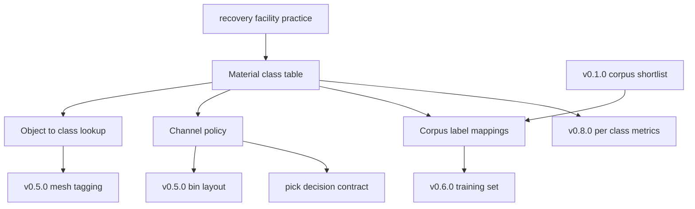

# Design Document

## Overview

This design fixes the structure of CLAVE's material taxonomy. It does not choose
the classes; the tasks generated from it do that, against the rules below.

The shape matters more here than in the v0.1.0 review, because this document is
a contract rather than a survey. Four later steps consume its class identifiers,
and a rename between them corrupts every downstream number silently. The design
therefore spends most of its effort on stability rules and on making information
loss visible at the corpus boundary.

The deliverable is one Markdown document under `docs/`. There is no code.

### Goals

- Fix a class table in which every class states the physical property that
  distinguishes it and the mechanism a recovery facility uses to separate it, so
  a class no line separates cannot hide.
- Fix an object lookup precise enough that tagging a mesh is mechanical.
- Fix a routing rule under which no object on the belt has an undefined
  destination.
- Make the loss at each corpus boundary explicit, so v0.6.0 knows what a corpus
  cannot teach before spending effort on it.
- Fix stability rules that say which decisions are safe to change.

### Non-Goals

- Choosing confidence thresholds, which need a trained model and belong to
  v0.8.0.
- Building bins, training sets, or classifiers.
- Claiming the class list was validated against a real line. None was observed.

## Boundary Commitments

### This Spec Owns

- The material class table, the class identifier scheme, and the append-only
  rule that governs it.
- The object to class lookup and its ambiguity markers.
- The channel policy, including the reject channel and the missed-pick rule.
- The per-corpus label mapping and the record of what fails to map.
- The stability rules that say which decisions a consumer may depend on.

### Out of Boundary

- **Confidence thresholds as numbers.** The taxonomy says a low-confidence
  object goes to reject; what counts as low confidence is a measured quantity
  that v0.8.0 sets.
- **The physical channel count.** A deployment supplies it. The taxonomy fixes
  the class-to-channel mapping as configuration, not as a constant.
- **Corpus selection.** v0.1.0 chose the corpora. This spec maps their labels
  and does not reopen the choice.
- **Mesh tagging and bin layout.** v0.5.0 consumes the taxonomy to do both.

### Allowed Dependencies

| Dependency | Direction | Criticality | Note |
|---|---|---|---|
| `docs/research/training-infrastructure-review.md` | Inbound | P0 | Supplies the corpora whose labels are mapped |
| Recovery facility practice sources | External | P0 | Cited for every separation mechanism claim |
| `standards/guidelines/agents/writing.md` | Inbound | P0 | Prose rules and the dating rule for external claims |
| `.kiro/specs/pick-decision-contract/` | Outbound | P1 | Consumes the class identifier; a rename breaks it |

### Revalidation Triggers

- A class is added, merged, or retired, which invalidates every downstream
  confusion matrix and every tagged mesh.
- v0.1.0's corpus shortlist changes, which invalidates the label mappings.
- The maintainer resolves the ZeroWaste license question, which would add a
  fourth corpus to map.
- A deployment reports a channel count the mapping cannot express.

## Architecture

### Existing Architecture Analysis

CLAVE holds no code. The precedent is `docs/research/training-infrastructure-review.md`,
delivered at v0.1.0, which established the house pattern for a decision document
in this repository: constraints stated once before any verdict, fixed table
headers, a closed vocabulary, and an open-questions section that names what could
not be determined.

This design follows that pattern with one change. The v0.1.0 review screens and
discards; this document defines and commits. Its tables therefore carry no
verdict column, and gain stability annotations instead.

### Architecture Pattern and Boundary Map

Six sections in a fixed order: classes, objects, channels, corpus mappings,
stability rules, open questions. Classes come first because everything else
references them. Corpus mappings come after channels because a mapping is only
meaningful once the target vocabulary is complete.



The class table is the single upstream node. Everything else reads it, and
nothing writes back into it, which is what makes the append-only rule
enforceable.

### Technology Stack

| Layer | Tool | Role |
|---|---|---|
| Document | Markdown, CommonMark tables | The single deliverable |
| Prose rules | `standards/guidelines/agents/writing.md` | Typography and the dating rule for claims that expire |

No dependency is added. No file outside `docs/` is created or modified.

## File Structure Plan

### Directory Structure

```
docs/
  waste-taxonomy.md
```

| File | Status | Responsibility |
|---|---|---|
| `docs/waste-taxonomy.md` | New | The entire deliverable: classes, objects, channels, corpus mappings, stability rules, open questions |

Every component named below is a section of that single file. The spec creates
no other file.

### Modified Files

None.

## Components and Interfaces

| Component | Intent | Requirements |
|---|---|---|
| Class table | Define the vocabulary everything else references | 1.1, 1.2, 1.4, 1.5 |
| Identifier scheme | Make the vocabulary safe to depend on | 1.3, 5.4 |
| Object lookup | Turn tagging into a lookup | 2.1, 2.2, 2.3, 2.4 |
| Channel policy | Give every object a destination | 3.1, 3.2, 3.3, 3.4, 3.5 |
| Corpus mappings | Make information loss visible | 4.1, 4.2, 4.3, 4.4, 4.5 |
| Stability rules | Say what is safe to change | 5.4 |
| Document conventions | Location, citation, regional hedging | 5.1, 5.2, 5.3, 5.5 |
| Open questions | Name what is undecided | 4.4, 5.5 |

### Class table

Exact header, in this order:

```
| Id | Class | Definition | Distinguishing property | Separation mechanism | Channel | Shared channel |
```

`Id` is `M-<NN>`, assigned in order and never reused. `Separation mechanism`
names what a recovery facility physically uses, such as an overhead magnet, an
eddy current separator, or near-infrared optical sorting, and satisfies 1.2. A
class whose mechanism cell reads `none` is a class no line separates, which is
the signal 1.2 exists to surface.

Exactly one row has `Class` of residue, satisfying 1.5. Exactly one row is the
reject destination, satisfying 3.2.

Where two classes are indistinguishable from a single overhead color image, the
`Distinguishing property` cell says so and the document states whether they are
merged or kept separate, satisfying 1.4. This is expected for clear PET against
clear PP, and for ferrous against non-ferrous metal, neither of which color
alone resolves.

### Object lookup

Exact header, in this order:

```
| Object | Class | Basis | Ambiguity |
```

At least fifteen rows, covering bottles, cans, boxes, tubs, cartons, and bags,
satisfying 2.1. `Basis` cites the practice or standard behind the assignment,
satisfying 2.2. `Ambiguity` holds a dash when none applies; otherwise it names
what would resolve it, satisfying 2.3. A multi-material object records the
governing material in `Class` and the rest in `Ambiguity`, satisfying 2.4.

### Channel policy

Prose, not a table, carrying four rules:

1. Every class routes to a channel, and the mapping is configuration supplied
   per deployment rather than a constant, satisfying 3.1 and 3.5.
2. Exactly one reject channel receives anything the system cannot route with
   confidence, satisfying 3.2. What counts as low confidence is out of boundary.
3. A channel may be shared by several classes, which is how a deployment with
   fewer channels than classes is expressed, satisfying 3.3. The `Shared
   channel` column in the class table carries this.
4. An object not picked before it leaves the reachable window continues down the
   belt untouched, and the document states what that means for the line,
   satisfying 3.4.

### Corpus mappings

One table per corpus shortlisted at v0.1.0, meaning SpectralWaste, TACO, and
TrashNet. Exact header:

```
| Corpus label | Maps to | Loss |
```

`Maps to` holds a class id, several class ids where one label spans more than
one class, or `unmapped`. `Loss` states what the mapping discards, satisfying
4.4. Every label in the corpus appears, so an unmapped label is listed rather
than dropped, satisfying 4.2.

Each corpus table is followed by two statements: what the corpus labels if it
does not label material, satisfying 4.3, and which classes it supplies no signal
for, satisfying 4.5. SpectralWaste is the case 4.3 exists for, since it labels
object kinds such as film and trash bags rather than materials.

### Stability rules

A short section naming, per decision, whether changing it is safe. Class ids and
the residue class are load-bearing; class display names and the object lookup
are not. Satisfies 5.4.

### Document conventions

- Published at `docs/waste-taxonomy.md`, satisfying 5.1.
- Every claim about recovery facility practice or a material standard carries a
  citation, satisfying 5.2.
- Practice that varies by region or operator says so rather than presenting one
  locality as universal, satisfying 5.3. Resin acceptance is the clearest case:
  which codes a facility takes is a local decision.
- The document states that no sorting line was observed and that the class list
  is derived from published practice, satisfying 5.5.

## Data Models

### Domain Model

- **MaterialClass**: id, name, definition, distinguishing property, separation
  mechanism, channel, shared-channel flag.
- **ObjectMapping**: object name, class id, basis citation, ambiguity note.
- **CorpusLabelMapping**: corpus, source label, target class ids or `unmapped`,
  loss note.

**Invariants:**

1. No cell is empty. Absence is written as a dash or `none`, never blank.
2. Every `Id` matches `M-<NN>` and is unique.
3. Exactly one class is residue, and exactly one channel is the reject
   destination.
4. Every class id referenced by an object mapping or a corpus mapping exists in
   the class table.
5. Every corpus label present in the source corpus appears in its table.

## Error Handling

| Condition | Response |
|---|---|
| Two classes are indistinguishable from an overhead image | State it and decide merge or keep separate, per 1.4 |
| An object's material is not visually determinable | Record as ambiguous and name what resolves it, per 2.3 |
| An object is multi-material | Name the governing material, per 2.4 |
| A corpus label maps to nothing | List it as unmapped, per 4.2 |
| A corpus label spans several classes | Record all of them rather than picking one, per 4.4 |
| Practice varies by region | Say so rather than generalizing, per 5.3 |

## Testing Strategy

Verification is document review. No code, so no unit suite.

**Structural checks:**

1. Class table header matches the declared schema exactly.
2. No cell in any table is blank.
3. Every `Id` matches `M-<NN>`, with no duplicates and no gaps that indicate
   reuse.
4. Exactly one residue class and exactly one reject channel exist.
5. Every class id referenced elsewhere exists in the class table.
6. The object lookup has at least fifteen rows covering the six required
   container kinds.
7. One mapping table exists per shortlisted corpus, each followed by its
   labels-what and supplies-no-signal statements.

**Content checks:**

1. Every separation mechanism names something a facility physically does, and a
   class with no mechanism is flagged rather than quietly assigned one.
2. Every object assignment cites a basis that actually supports it.
3. Every claim that varies by region is hedged.
4. No number presented as measured, and no claim that a line was observed.

## Requirements Traceability

| Requirement | Summary | Component | Contract |
|---|---|---|---|
| 1.1 | Classes with id, definition, distinguishing property | Class table | Header columns 1 to 4 |
| 1.2 | Separation mechanism per class | Class table | `Separation mechanism` |
| 1.3 | Identifiers append-only | Identifier scheme | `M-<NN>`, never reused |
| 1.4 | Visually indistinguishable classes declared | Class table | `Distinguishing property` |
| 1.5 | Exactly one non-recyclable class | Class table | Residue row |
| 2.1 | Fifteen objects across six container kinds | Object lookup | Row count and coverage |
| 2.2 | Assignment cites practice | Object lookup | `Basis` |
| 2.3 | Visually ambiguous object recorded | Object lookup | `Ambiguity` |
| 2.4 | Multi-material governing class | Object lookup | `Class` plus `Ambiguity` |
| 3.1 | Every class routed | Channel policy, Class table | `Channel` |
| 3.2 | Exactly one reject channel | Channel policy | Rule 2 |
| 3.3 | Shared channels expressible | Class table | `Shared channel` |
| 3.4 | Missed pick defined | Channel policy | Rule 4 |
| 3.5 | Mapping is configuration | Channel policy | Rule 1 |
| 4.1 | Every shortlisted corpus mapped | Corpus mappings | One table per corpus |
| 4.2 | Unmapped labels listed | Corpus mappings | `Maps to` = `unmapped` |
| 4.3 | Non-material labels explained | Corpus mappings | Labels-what statement |
| 4.4 | Spanning labels record ambiguity | Corpus mappings | `Maps to` with several ids, `Loss` |
| 4.5 | Classes a corpus cannot teach | Corpus mappings | Supplies-no-signal statement |
| 5.1 | Published under `docs/` | Document conventions | File path |
| 5.2 | Practice claims cited | Document conventions | Inline citation |
| 5.3 | Regional variation hedged | Document conventions | Inline hedge |
| 5.4 | Safe and unsafe changes named | Stability rules | Section presence |
| 5.5 | No claim of line validation | Document conventions, Open questions | Explicit statement |

## Open Questions and Risks

- **The class list cannot be validated here.** No sorting line was observed, so
  the taxonomy is derived from published practice and is a proposal until
  someone checks it against a real facility. 5.5 requires the document to say so.
- **Resin acceptance varies by operator.** Which codes a facility takes is
  local, so a taxonomy that fixes them globally will be wrong somewhere. Handled
  by hedging under 5.3 and by making channel assignment configuration under 3.5.
- **ZeroWaste is not mapped.** It failed `S1` at v0.1.0 on its NonCommercial
  license. If the maintainer narrows CLAVE's stated intent, ZeroWaste advances
  and this document needs a fourth mapping table.
