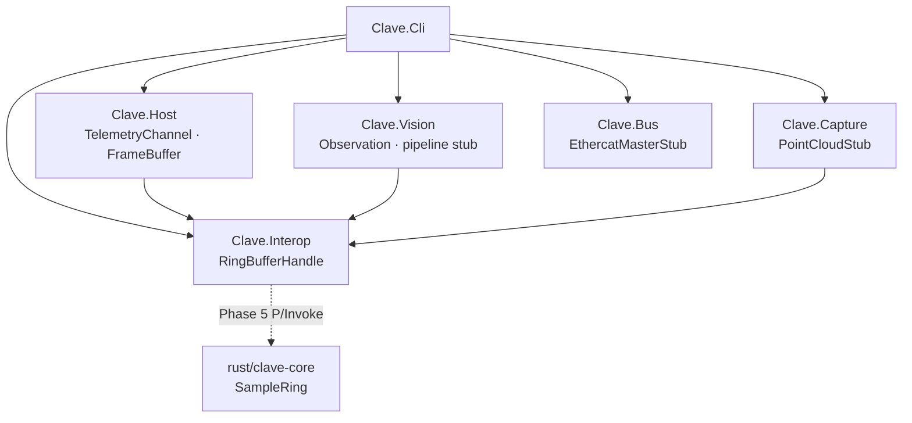

# CLAVE

**CLAVE** = **C**ross-**L**anguage **A**rchitecture for **V**ision & **E**dge

> CLAVE (Cross-Language Architecture for Vision & Edge) is a private lab for high-reliability perception and interop: low-allocation C# hosts, vision/ONNX pipelines, 3D capture/calibration, and auditable Rust hot paths — the clef for reading the industrial stack that complements arco/fret/luthier/bossa.

The name *clave* is Portuguese for musical clef — the key to reading the industrial score. It belongs to the same musical naming family as **arco**, **fret**, **luthier**, and **bossa**.

| Document | Description |
| --- | --- |
| [docs/specification.md](docs/specification.md) | Product specification and Phase 0 acceptance (SDD) |
| [docs/architecture.md](docs/architecture.md) | Module map, boundaries, and interop direction |
| [docs/roadmap.md](docs/roadmap.md) | Phased delivery aligned to MAF study modules |
| [docs/guidelines.md](docs/guidelines.md) | Coding conventions for C# and Rust |
| [CONTRIBUTING.md](CONTRIBUTING.md) | Constitution: SDD, V-cycle, quality gates, agent policy |

---

## Mission

Private specialization lab for a MAF study plan covering:

- C# / .NET memory and async (Span, ValueTask, Channels)
- Vision / ONNX in .NET (contracts toward fret observations)
- RealSense capture, calibration, and EtherCAT concepts
- Rust hot paths with auditability and a future C ABI

Bridge contracts toward sibling repos later; **do not vendor** them.

---

## Architecture



| Module | Role (Phase 0) |
| --- | --- |
| **Clave.Host** | Bounded `TelemetryChannel<T>`, `FrameBuffer` (`readonly ref struct`) |
| **Clave.Vision** | `Observation` record + synthetic pipeline stub |
| **Clave.Capture** | Synthetic XYZ point cloud stub |
| **Clave.Bus** | EtherCAT master stub (no SOEM) |
| **Clave.Interop** | Managed `RingBufferHandle` (FFI later) |
| **Clave.Cli** | Console smoke entry |
| **clave-core** (Rust) | `SampleRing` with overwrite-when-full |

---

## Repository layout

```text
clave/
├── Clave.sln
├── Directory.Build.props
├── global.json                 # SDK 8.0, rollForward latestFeature
├── config/telemetry.example.yml
├── docs/
├── scripts/                    # setup, build, validate
├── rust/clave-core/            # cdylib + rlib stub crate
├── src/
│   ├── Clave.Host/
│   ├── Clave.Vision/
│   ├── Clave.Capture/
│   ├── Clave.Bus/
│   ├── Clave.Interop/
│   └── Clave.Cli/
└── tests/
    ├── Clave.Host.Tests/
    └── Clave.Interop.Tests/
```

---

## Requirements

| Tool | Version |
| --- | --- |
| .NET SDK | 8.0 (`global.json`; rollForward `latestFeature`) |
| Rust | stable (`cargo`, `rustc`) |
| Git | any recent |

`mise` is optional and not pinned by this repo.

---

## Build and test

```bash
git clone https://github.com/alexandrelheinen/clave.git
cd clave
./scripts/setup.sh
./scripts/validate.sh
```

Or run gates individually:

```bash
dotnet build Clave.sln
dotnet test Clave.sln
cargo test --manifest-path rust/clave-core/Cargo.toml
dotnet run --project src/Clave.Cli/Clave.Cli.csproj
```

CI runs `./scripts/validate.sh` on pull requests and pushes to `main`.

---

## Status

**Phase 0 — scaffold.** Stubs compile and test. No RealSense, OpenCV, ONNX, or EtherCAT native dependencies yet. See [docs/roadmap.md](docs/roadmap.md).

---

## Contributing

Follow [CONTRIBUTING.md](CONTRIBUTING.md). Humans merge; agents do not.

---

## License

MIT — Copyright (c) 2026 Alexandre Loeblein Heinen. See [LICENSE](LICENSE).
